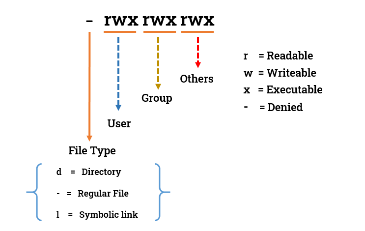

## Day 01/100 – Basic commands & Linux File Permissions

### File permissionos in linux:

In linux every file and folder has 3 three types of permissions:

* Read (r or 4) = View the file 
* Write (w or 2) = Modify the file
* Execute (x or 1) = Run the file as a program/script


This permission are assigned to three  categories:

* user(owner)  = Person who owns the file
* group = Users in the same group
* Others = Everyone else

Structure:




Check out the file [filepermission.sh](filepermission.sh).

### Basic commands:

Check out the file [basiccommands.sh](basiccommands.sh)


### Why private SSH keys require chmod 400 to connect to EC2

If the private key is accessible by anyone other than its owner, the SSH client refuses to use it for security reasons.

```bash

WARNING: UNPROTECTED PRIVATE KEY FILE!
Permissions 0644 for 'my-key.pem' are too open.
This private key will be ignored.

```

So change the permissions of the private key to chmod 400 ensures that only the file owner can read the private SSH key.

