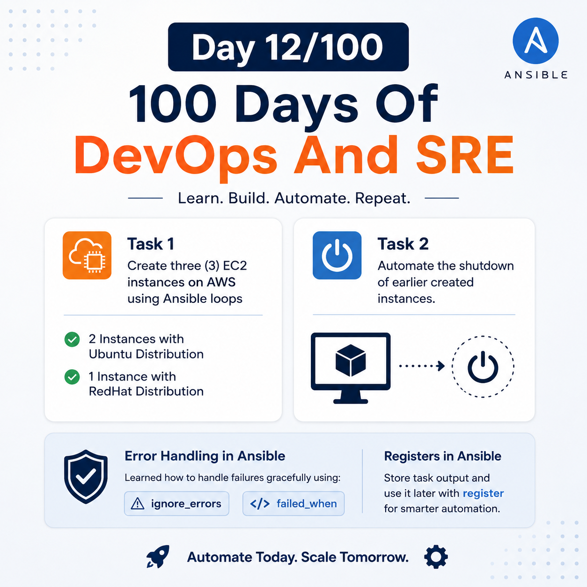
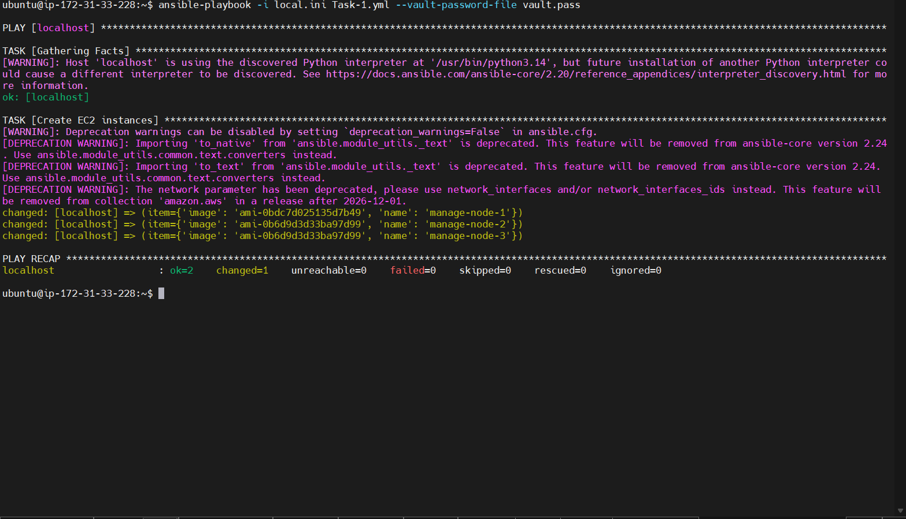
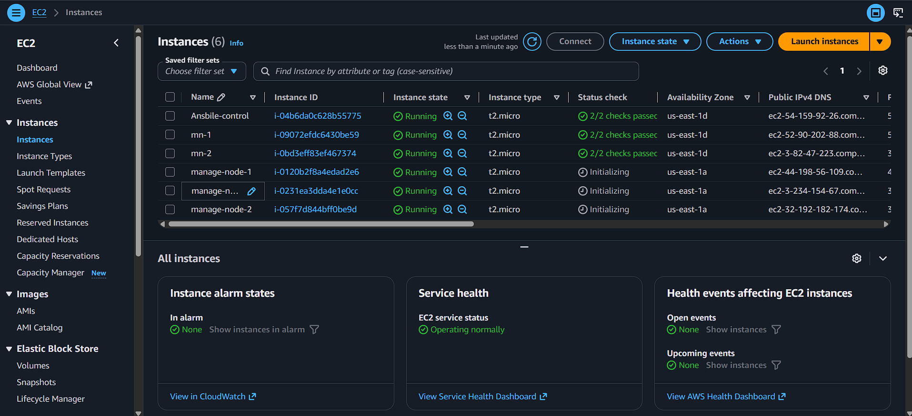
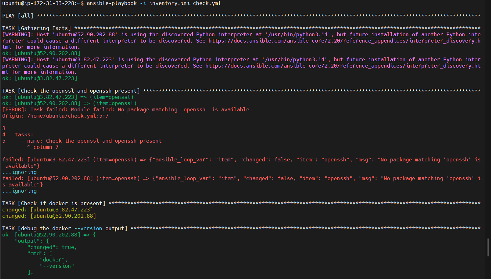

## Day 12/100 – Ansible Real Time Tasks & Error Handling.

## Task 1

Create three(3) EC2 instances on AWS using Ansible loops

- 2 Instances with Ubuntu Distribution
- 1 Instance with RedHat Distribution

Solution provided in the [Task-1](Task-1.yml)

## Task 2: 

* Automate the shutdown of earlier created instances.

Solution provided in the [Task-2](Task-2.yml)

---

For more details, Check [Day-11](../Day-11/collection.md)

* Like how to create and execute.

## Error Handling

Check the [Error Handling](error-handling.md) page for detail view.

For Reference:

