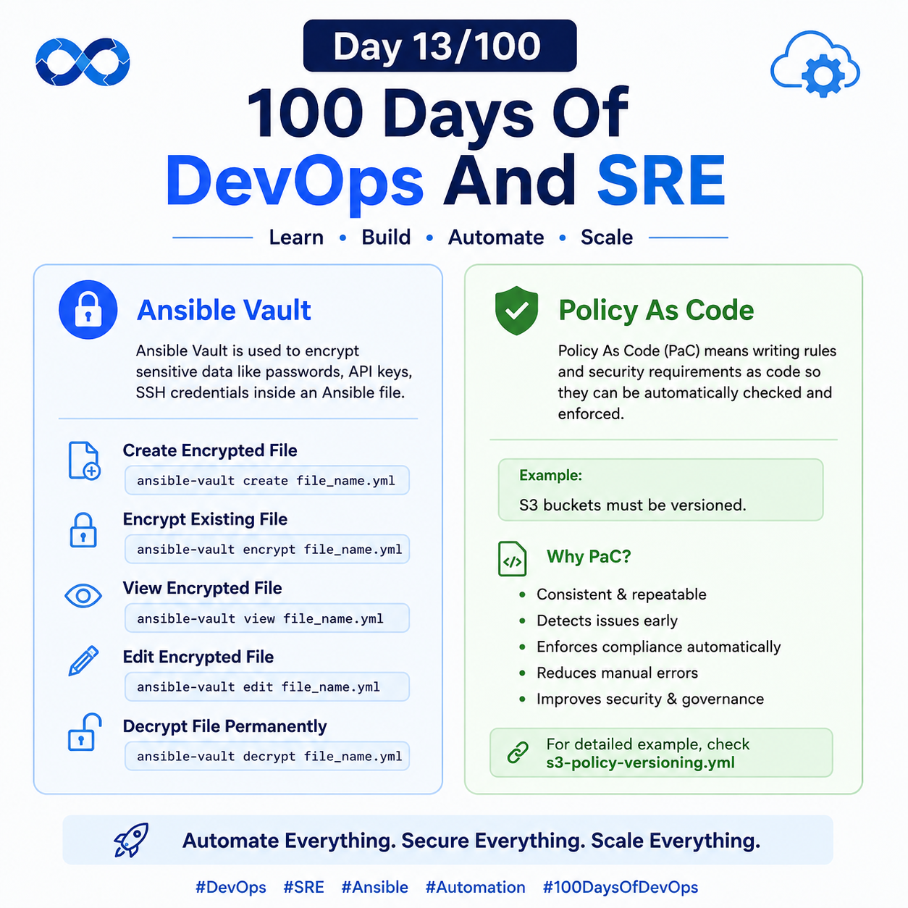
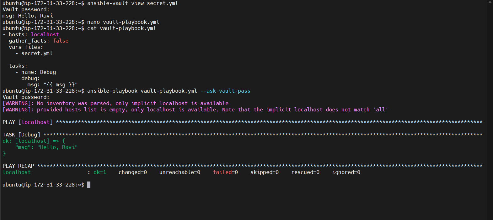

## Day 13/100 – Ansible Vault & Error & Policy As Code

## Ansible Vault

For details check [Ansible Vautl](ansible-vault.md) page

## Policy As Code

Poclicy As Code(Pac) means writng rules and security requirements as code so they can be automatically checkec and enforced.

Eg:

s3 buckets must be versioned.

For detail example, check the [s3-policy-versioning.yml](s3-policy-versioning.yml)

For reference:

