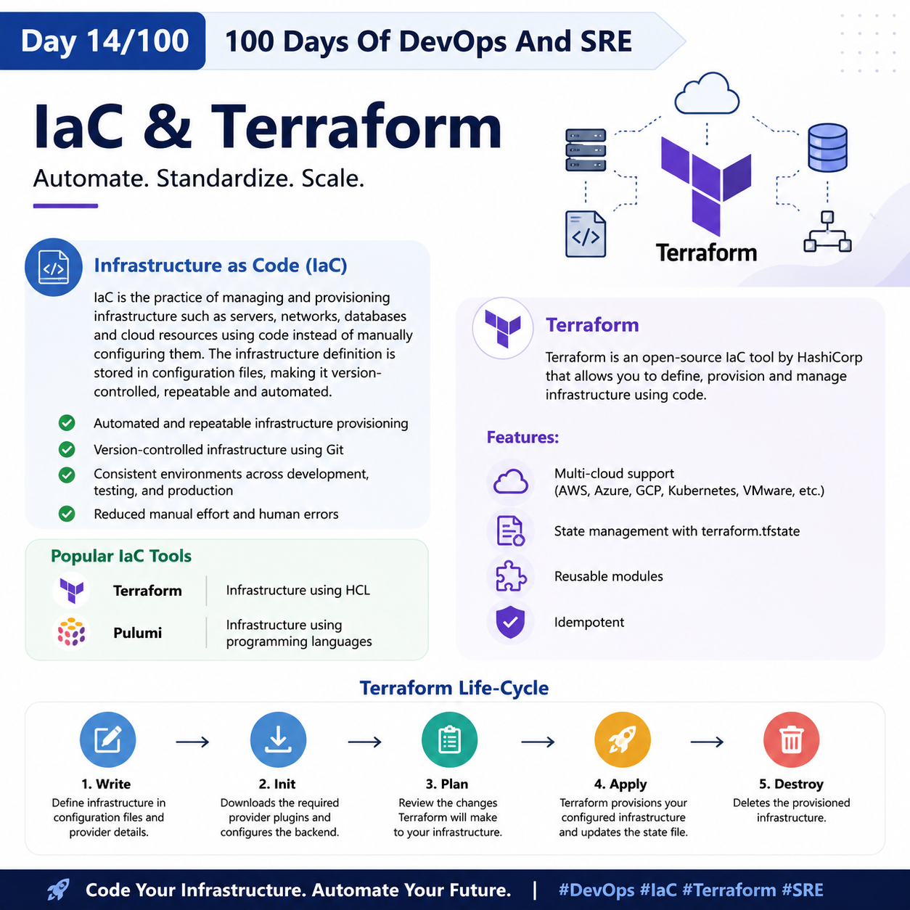
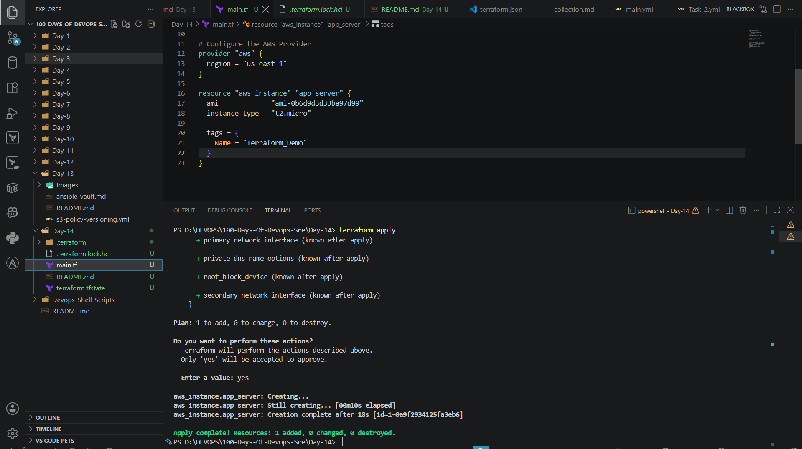

## Day 14/100 – IaC & Terraform.

## Infrastructure as Code (IaC):

IaC is the practice of managing and provisioning infrastructure such as servers,networks, databases and cloud resources using code instead of manually configuring them. The infrastructure defination is stored in the configuration files, making it version-controlled, repeatable and automated.

- Automated and repeatable infrastructure provisioning

- Version-controlled infrastructure using Git

- Consistent environments across development, testing, and production

- Reduced manual effort and human errors

**Popular IaC tools:**

* Terraform  -  Infrastructure using HCL.
* pulumi     - 	Infrastructure using programming languages.

## Terraform:

Terraform is an open-source IaC tool by HashiCorp that allows you to define, provision and manage infrastucture using code.

**Features:**

* Multi-cloud support (AWS, Azure, GCP, Kubernetes, VMware, etc.)

* State management with terraform.tfstate

* Reusable modules

* Idempotent

**Life-Cycle:**

Write - Define infrastructure in configuration files and provider details.

Init - Downloads the required provider plugins and configures the backend.

Plan - Review the changes terraform will make to your infrastructure.

Apply - Terraform provision your configured infrastucture and updates the state file.

Destory - Deletes the provisioned infrastucture.

Eg: 

Check out [Basic Terraform](main.tf)

For reference:

