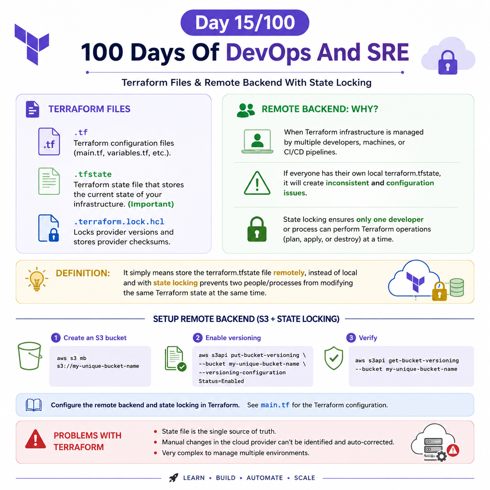
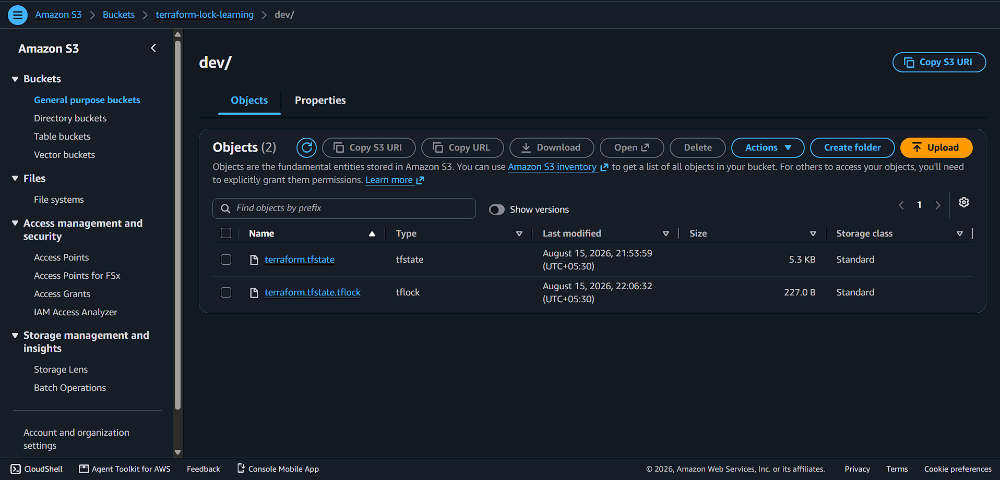

## Day 15/100 – Terraform Files & Remote Backend With State Locking

## Terraform file:

* .tf                 - Terraform configuration files (main.tf, variables.tf, etc.).
* .tfstate            - Terraform state file that stores the current state of your infrastructure. (Important)
* .terraform.lock.hcl - Locks provider versions and stores provider checksums.

---


## Remote Backend:

**Lets understand the need of Remote Backend:**

The remote Backend is needed mainly when terraform infrastructure is managed by multiple developers, machines, or CI/CD pipelines.

Eg:

Dev A terraform.tfstate file in local

Dev B terraform.tfstate file in local

CI/CD terraform.tfstate file in machine local

Here, Dev A, Dev B, CI/CD work on the same infrastructure, It will create inconsistent and configure issue.

And with state locking helps only one developer or CI/CD can perform the terraform operations(plan,apply or destory) at the same time.

**Defination:**

It simply means store the terraform.tfstate file in remotely, instead of local and with state locking prevents two people/processes from modifying the same Terraform state at the same time.

### 1. Create an S3 bucket for backend storage

```
aws s3 mb s3://my-unique-bucket-name

```

### 2.Enable versioning

```
aws s3api put-bucket-versioning `
    --bucket my-unique-bucket-name `
    --versioning-configuration Status=Enabled
```
### Verify:
```
aws s3api get-bucket-versioning --bucket my-unique-bucket-name
```
### 3. Configure the remote backend and state locking

See [main.tf](main.tf) for the Terraform configuration.

---


## Problems With Terrform

* State file single source of truth. 
* Manual changes in the cloud provider can't be identified and auto-corrected.
* Very complex to managed multiple environments.


For reference:


