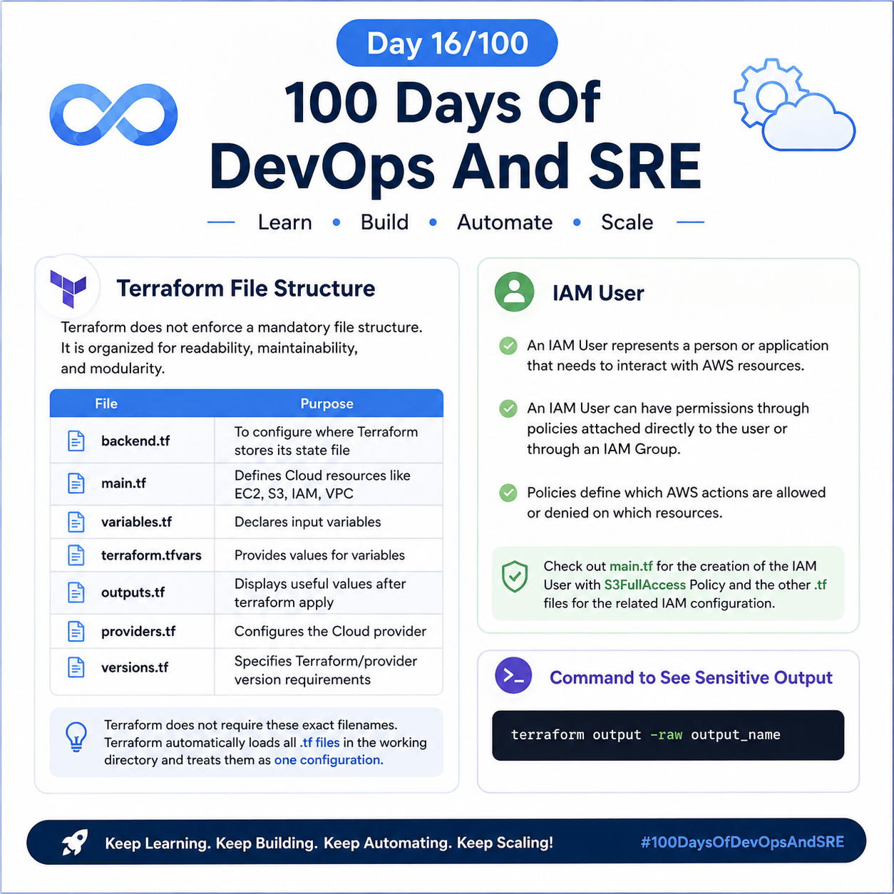
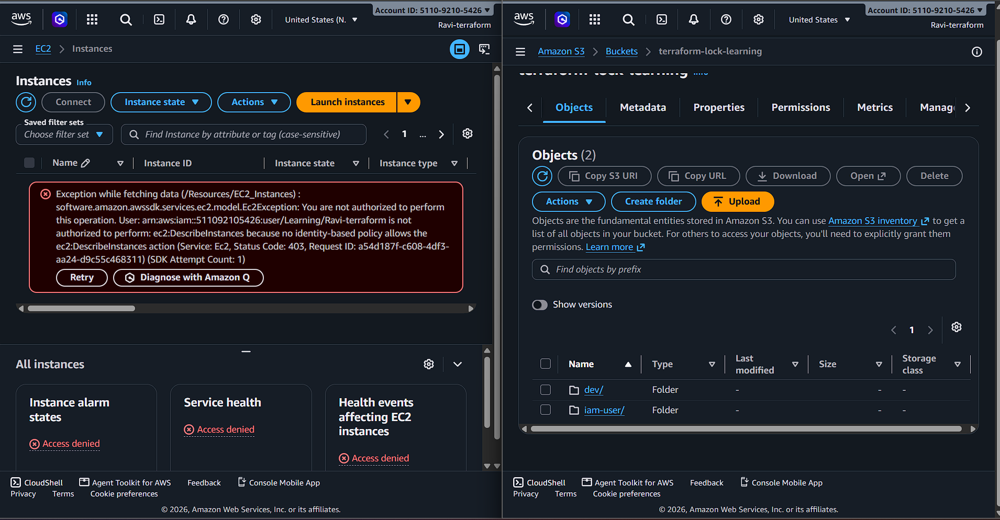

## Day 16/100 – Terraform Files Structure && IAM User

### Terraform File structure:

Terraform does not enforce a mandatory file structure. The file structure is mainly organized based on readability, maintainability, and modularity.

| File  | Purpose |
| ------------- |:-------------:|
| backend.tf | To configure where Terraform stores its state file |
| main.tf |	Defines Cloud resources like EC2, S3, IAM, VPC |
| variables.tf |	Declares input variables |
| terraform.tfvars |	Provides values for variables |
| outputs.tf |	Displays useful values after terraform apply |
| providers.tf |	Configures the Cloud provider |
| versions.tf | 	Specifies Terraform/provider version requirements |

> Terraform does not require these exact filenames. Terraform automatically loads all .tf files in the working directory and treats them as one configuration.


### IAM User:

* An IAM User represents a person or application that needs to interact with AWS resources.

* An IAM User can have permissions through policies attached directly to the user or through an IAM Group.

* Policies define which AWS actions are allowed or denied on which resources.

Check out [main.tf](main.tf) for the creation of the IAM User with S3FullAccess Policy and the other .tf files for the related IAM configuration.


###  Command to see sensitive output:

```
terraform output -raw output_name
```

Check Out [Day-14](../Day-14/README.md) and [Day-15](../Day-15/README.md) to get clarity.


For reference:

