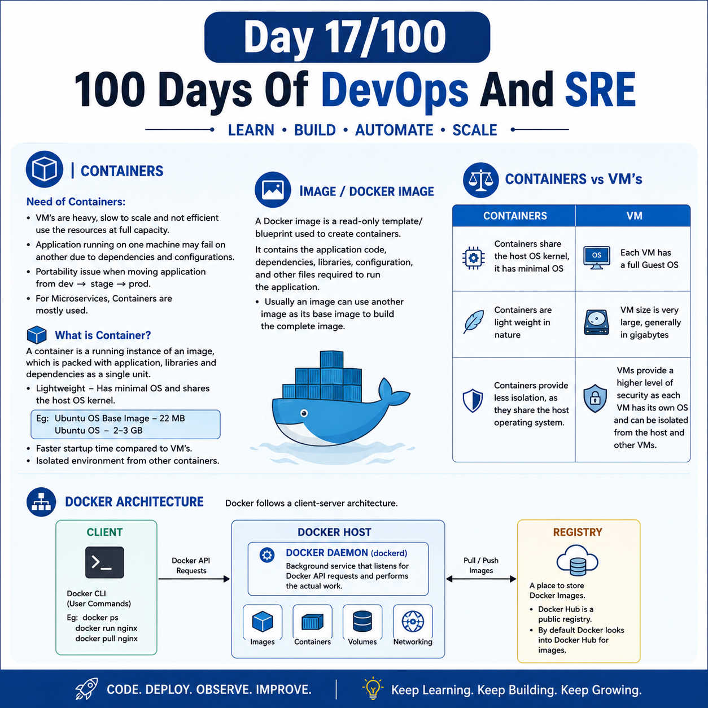

## Day 17/100 - Containers & Docker Architecture.

## Containers

**Need of the Containers :**

* We need Containers because VM's (Virtual Machines) are heavy,slow to scale and not efficient use the resources at full capacity.

* Application running one machine fail in other machine because of the dependies and other configuration.\

* Portability issue moving application from dev -> stage -> prod.

* For Microservices Containers mostly used.

### What is Container?

Containers is a running instance of an Image, which is packed with application, libraries and dependencies as a sinlge unit.

* Containers ar light weight, because it doesn't contain the full os and it has minial os and share with Host os kernal.

Eg: Ubuntu Os Base Image - 22 MB
    Ubuntu Os - 2-3 GB

* Containers are faster starup time compared to VM's.

* Containers are isolated environment from the other Containers.

## Image/Docker Image:

A Docker image is a read-only template/blueprint used to create containers. It contains the application code, dependencies, libraries, configuration, and other files required to run the application.

* Usally an image can use another image as its base image to build the complete image.

## IMP : Difference between the Containers Vs VM's

| Contianers  | VM |
| ------------- |:-------------:|
| Containers share the host OS kernel, it has minimal OS   | Each VM has a full Guest OS     |
| Containers are light weight in nature | VM size is very large, generally in gigabytes |
| VMs provide a higher level of security as each VM has its own operating system and can be isolated from the host and other VMs. |  Containers provide less isolation, as they share the host operating system. |

## Docker Architecture

Check Out [Docker Architecture](docker_architecture.md) 

For reference:

