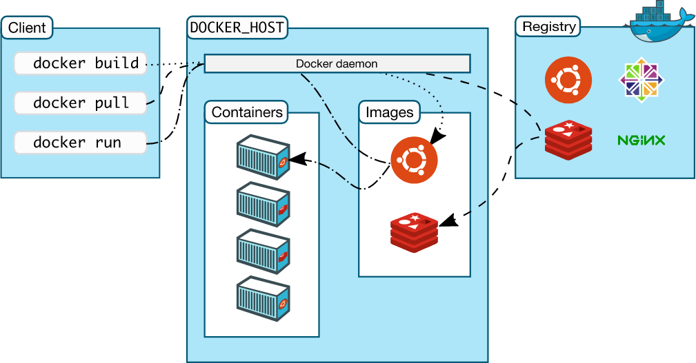

## Docker

Docker is an open-source containerization platform that provide easy way to containze your application.

* Docker is used build, package, ship, and run applications in isolated containers.

* Docker is widely used containerizationo platform

Other Tools for containerizatoin: Podman, Buildah etc..

## Docker Architecture

 Docker follows a client-server architecture.

### Docker client

Docker client is primary way that docker users interact with the docker.

* Docker client is CLI (Command-line Interface) it uses commands to interact with the docker.

Eg:

docker ps
docker run nginx
docker pull nginx

### Docker Host

A Docker Host is a physical or virtual machine that runs the Docker Engine.

### Docker Daemon (dockerd)

Docker Daemon (dockerd) is the background service of Docker that listens for Docker API requests and performs the actual work of creating, running, and managing containers.

* It core part of the docker for containerization.

* It manages the Images, Containers, Volumes, Networking.

### Registry

A registry is a place to store the Docker Images.

* Docker Hub is public registry to store Images.

* By default Docker look into Docker Hub for Images.