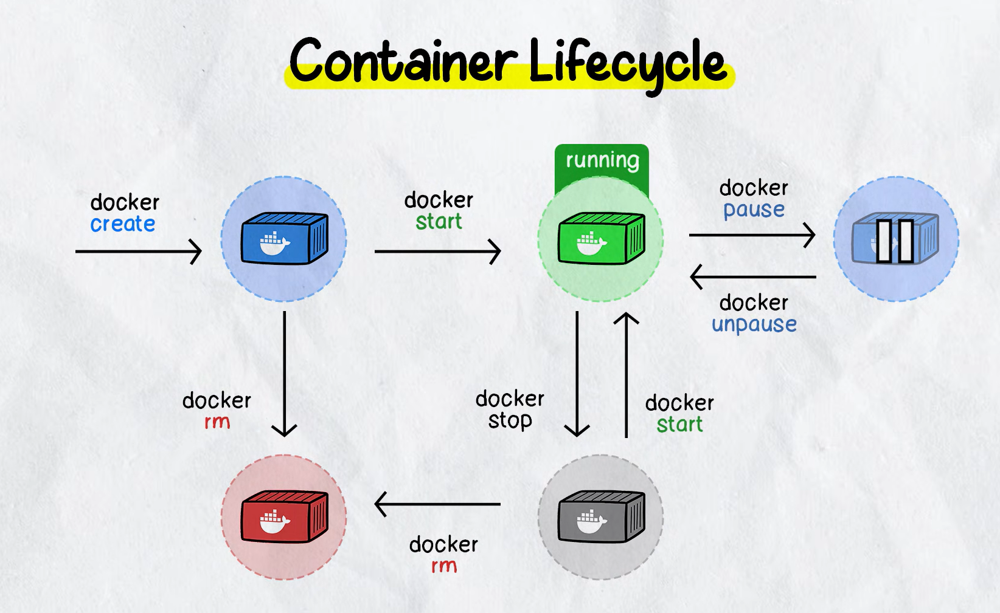
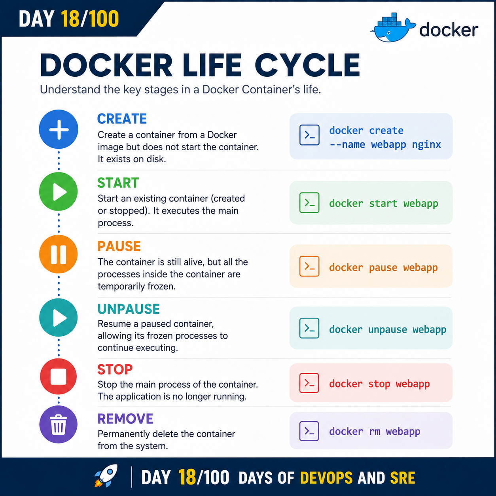

## Day 18/100 - Docker Life Cycle & Practice.

## Docker Life Cycle



### Create 

Create Container from a Docker Image but does not start the container,It exist in the disk.

Eg:

```
docker create --name webapp nginx
```

### Start

Starting the existing Container which is present in the disk either created/stopped. It executing the main process.

Eg:
```
docker start webapp
```

### Pause

Pause means the Docker Container is still alive, but all the prcoess inside the Container are temporarily frozen.

Eg:
```
docker pause webapp
```
### Unpause

Unpause means resuming a paused container, allowing its frozen processes to continue executing.

Eg:
```
docker unpause webapp
```
### Stop

Stop means the main process of the Container is terminated, the application is no longer running.

Eg:
```
docker stop webapp
```

### Remove

Remove means permanently delete the Container from the system.

Eg:
```
docker rm webapp
```

For reference :

