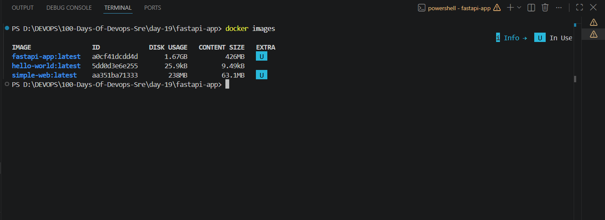
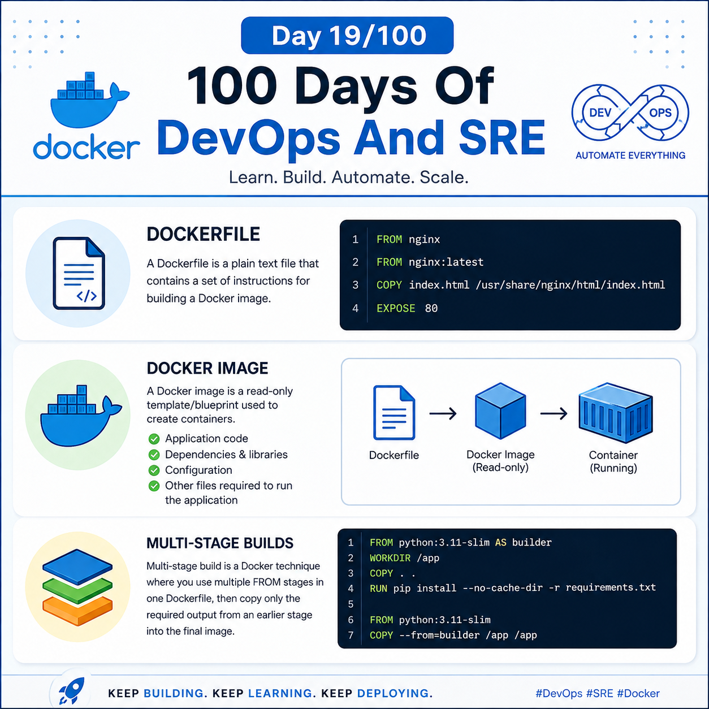

## Day 19/100 - Dockerfile,Images && Multi-stage builds


## Dockerfile

A Dockerfile is a plain text file that contains a set of instructions for building a Docker image. 

Eg:

```
FROM nginx

FROM nginx:latest

COPY index.html /usr/share/nginx/html/index.html

EXPOSE 80
```
Check out [Dockerfile](web/Dockerfile)

## Docker Image

A Docker image is a read-only template/blueprint used to create containers. It contains the application code, dependencies, libraries, configuration, and other files required to run the application.

Eg:




## Multi-stage builds

Multi-stage build is a Docker technique where you use multiple FROM stages in one Dockerfile, then copy only the required output from an earlier stage into the final image.

Eg:

Check out [Multi-Stage builds](fastapi-app/Dockerfile)


For reference :

