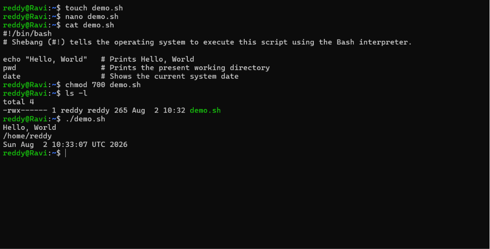
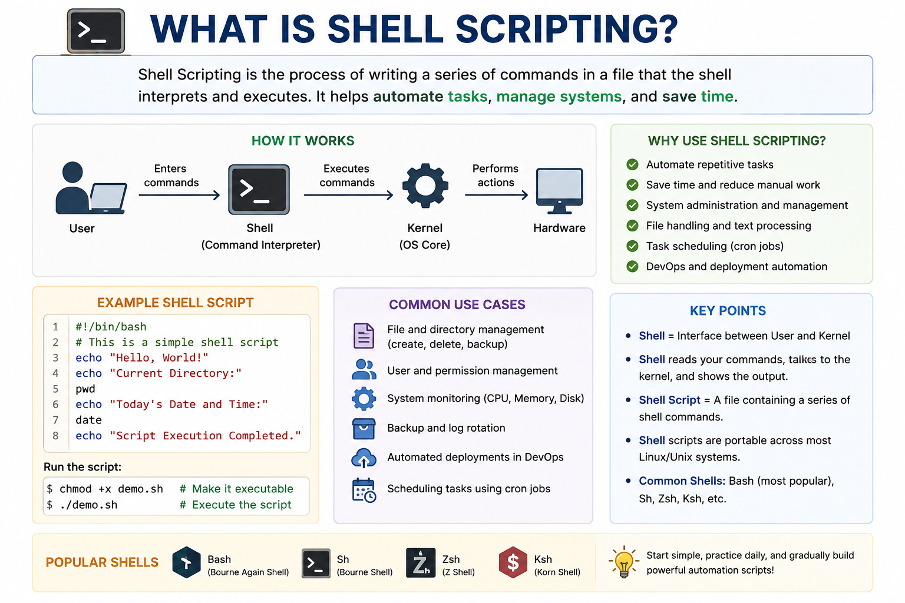

## Day 02/100 – Shell Scriping

### Shell Scripting

**Shell** = Shell is an interface between the user and the Linux kernel. It accepts user commands, passes them to the kernel for execution, and displays the output.

User -> Shell -> Kernel -. Hardware

> Shell the read the commands user type, find the command program,talks to kernal and shows the output on the screen.


**Shell Scriping** = Shell scripting is the process of writing a series of Linux shell commands into a script file so they can be executed automatically instead of typing each command manually.

File extension should be **filename.sh**. E.g: demo.sh

Example: demo.sh

```bash
#!/bin/bash
# Shebang (#!) tells the operating system to execute this script using the Bash interpreter.

echo "Hello, World"   # Prints Hello, World
pwd                   # Prints the present working directory
date                  # Shows the current system date

```

By default the execution permission not given to file. so change the permission to execute file :

```bash
chmod 700 demo.sh
```
> NOTE: Based on the requirements change the permission of the file to all execute or only owner execute. Check out [Day-1](../Day-1/README.md) for file permissions.


Run it:

```bash
./deploy.sh  # ./ Tells execute the file.
```
For reference:




Check out below scripts: 

* [filemodification.sh](filemodification.sh) 

Next upcoming days more shell scripts will shared in the Shell-Scripts folder.

