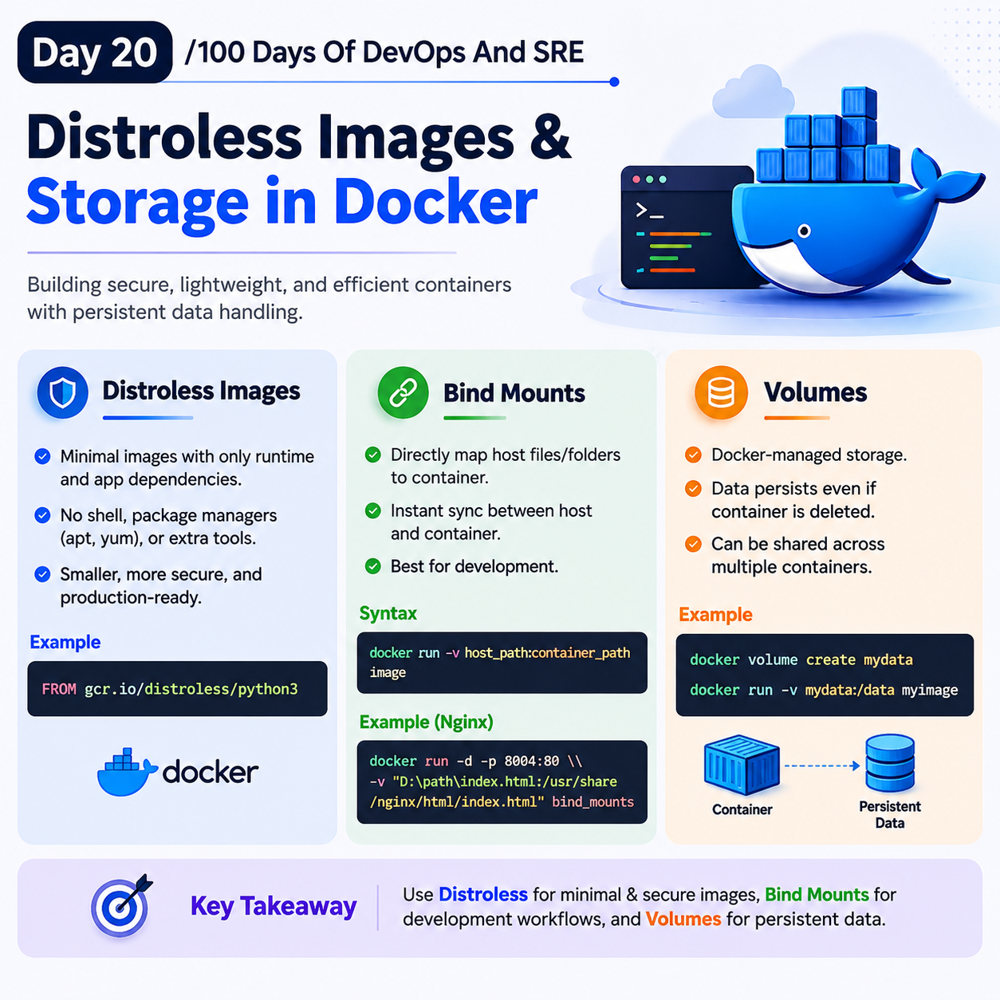

## Day 20/100 - Distroless Images, Bind Mounts & Volumes

### Distroless images

Distroless images are minimal Docker images that contain only your application and its required runtime dependencies, without any  normal Linux distribution's extra tools like shell, package managers(apt,yum).

* Distroless images are secure and small.

* Distroless images are prodution focused.

* Distroless images are developed by google open-source project called GoogleContainerTools/Distoless.

Eg:
```
FROM gcr.io/distroless/python3
```

Check Out [Distroless Example](python/Dockerfile).


### Distroless Images + Multi Stage Builds

When we combine the Multi Stage Builds & Distroless Images it reduces the image size, improve the security.

* It gives the production ready image.

Eg:

Check out [Example](fastapi-app/Dockerfile)


> NOTE: Containers are ephemeral(short live), so the data inside container will be delete automatically. To solvle the issue we have Bind Mounts and Volulmes.

### Bind Mounts

A Docker bind mount is a mechanism that directly links a file or directory from your host machine's filesystem to a specific path inside a Docker container. Any changes made to the files are instantly synchronized between the host and the container in real-time.

* Main use: Development, especially when source code changes frequently.

Syntax:
```
docker run -v host_folder: Container_folder image.
```

Eg:

Check out [bind_mounts](bind_mounts_volumes/Dockerfile)
```
docker build -t myimage .

docker run -d -p 8004:80 -v "D:\DEVOPS\100-Days-Of-Devops-Sre\day-20\bind_mounts\index.html:/usr/share/nginx/html/index.html" myimage
```

### Volume

Volume is a Docker-managed storage area used to persist container data even after the container is deleted.

* Volumes are managed by Docker, such as creating, attaching, and deleting volumes.

* Volumes allow multiple containers to share and access the same persistent data. (Databases Containers)

Eg:


Check out [Volumes](bind_mounts_volumes/Dockerfile)
```
docker volume create mydata

docker run -d -p 8005:80 -v mydata:/usr/share/nginx/html/ myimage
```


For reference:

