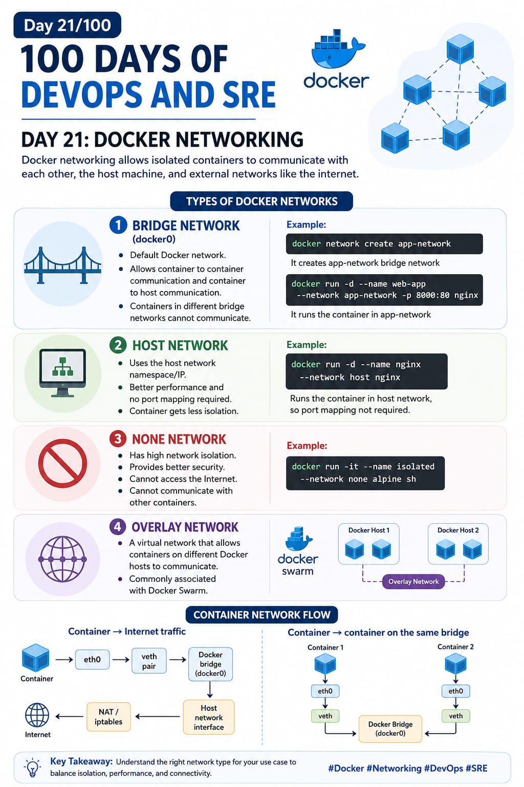

## Day 21/100 - Docker Networking

### Docker Networking

Docker networking is the core mechanism that allows isolated containers to communicate with each other, the host machine, and external networks like the internet.

### Types of Docker networks:

### 1.Bridge Network(docker0)

A Docker bridge network is a virtual network (virtual switch) created by Docker that allows containers to communicate with each other and with the Docker host.

* It's default docker network.

* It allow container to container communication and container to host communication.

* One bridge network container can't communicate with another bridge network container.

Eg:
```
docker network create app-network 
```
It create app-network bridge network

```
docker run -d --name web-app --network app-network -p 8000:80 nginx
```
It run the container in app-network

### 2.Host Network

A host network in Docker means the container uses the host machine's network stack directly instead of getting its own separate network namespace/IP.

* It used the host network namespace/IP.

* Better performance and no port mapping required

* Container get less isolation.

Eg:
```
docker run -d --name nginx --network host nginx
```
It runs the contianer in the host network so port mapping not required.


### 3 None Network

None network means the container has no networking. It gets only a loopback (127.0.0.1) interface and cannot communicate with other containers, the host, or the Internet through Docker networking.

* It has high network isolation.

* Provide better security.

*  Cannot access the Internet.

*  Cannot communicate with other containers.

Eg:
```
docker run -it --name isolated --network none alpine sh
```


### Overlay Network

A Docker overlay network is a virtual network that allows containers running on different Docker hosts to communicate with each other.

* It's commonly associated with Docker Swarm


### Container Network Flow:

**Container → Internet traffic**


Container
   │
  eth0
   │
 veth pair
   │
 Docker bridge (docker0)
   │
 Host network interface
   │
 NAT / iptables
   │
 Internet


**container → container on the same bridge**

Container 1
    │
   eth0
    │
  veth
    │
 Docker Bridge
    │
  veth
    │
   eth0
    │
Container 2


For reference:

