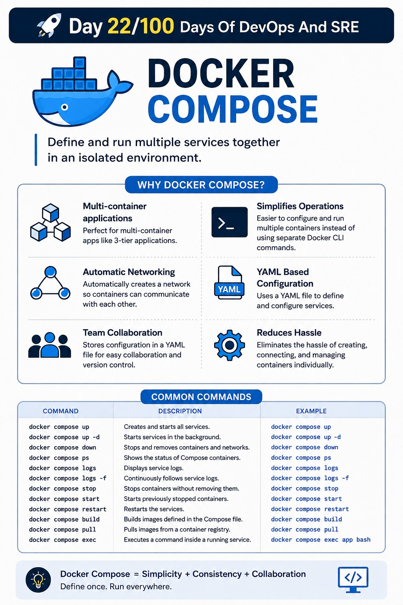

## Day 22/100 – Docker Compose

### Docker Compose

Docker Compose is a tool that allows you to define and run multiple services that belong together in an isolated environment.

* It is used for multi-container Docker applications, such as 3-tier applications.

* It provides an easy way to configure and run multiple containers instead of using separate Docker CLI commands.

* It automatically creates a network so that the containers can communicate with each other.

* It uses a YAML file to define and configure the services.

* It helps with team collaboration and version control by storing the Docker Compose configuration in a YAML file.

* It reduces the hassle of creating each container, connecting them through networks, and managing them individually.

Eg:

Check out [Docker Example](docker-compose.yml)

**Commands**

| Command | Description | Example |
|---|---|---|
| `docker compose up` | Creates and starts all services. | `docker compose up` |
| `docker compose up -d` | Starts services in the background. | `docker compose up -d` |
| `docker compose down` | Stops and removes containers and networks. | `docker compose down` |
| `docker compose ps` | Shows the status of Compose containers. | `docker compose ps` |
| `docker compose logs` | Displays service logs. | `docker compose logs` |
| `docker compose logs -f` | Continuously follows service logs. | `docker compose logs -f` |
| `docker compose stop` | Stops containers without removing them. | `docker compose stop` |
| `docker compose start` | Starts previously stopped containers. | `docker compose start` |
| `docker compose restart` | Restarts the services. | `docker compose restart` |
| `docker compose build` | Builds images defined in the Compose file. | `docker compose build` |
| `docker compose pull` | Pulls images from a container registry. | `docker compose pull` |
| `docker compose exec` | Executes a command inside a running service. | `docker compose exec app bash` |

For reference:

