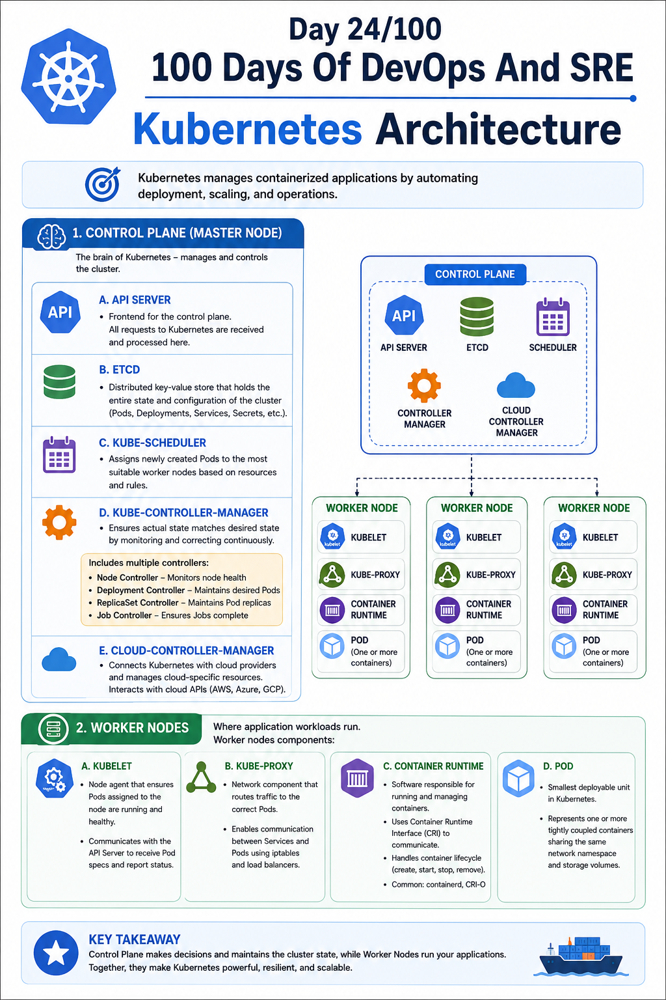

## Day 24/100 – Kubernetes Architecture

Let's talk about each component:

## 1. Control Plane/Master Node:

Control plane is the brain of kubernets. It manages and controll all worker nodes and decides what should run, where it should run, and continuously tries to make the actual cluster match the desired state.

### A. API Server:

The API server is the front end for the Kubernetes control plane. It is the central component through which all requests to Kubernetes are received and processed.

* In the Cluster kubectl, controllers, kubelets, and other components communicate through the API server.

### B. etcd:

etcd is a distributed key-value pair database that store the  entire current state and configuration of the kubernetes cluster.

* It stores state of pods, deployments, services, nodes, configurations and secrets and other kubernets objects.

### C. kube-scheduler:

Kube-scheduler assign newly created pods to the most suitable worker nodes based on available resources and rules.

* It is decision maker that selects the best worknode for a pod should be run.

### D. kube-controller-manager:

Controller manager ensures the actual state of the cluster match with desired state  by continuosuly monitoring and correcting it.

Desired State - What you want Kubernetes to have/run.

Actual State  - What actual currently running the kubernetes cluseter.

**Controller Manager contains multiple controllers, each responsible for a specific task:**

- Node Controller – Monitors worker nodes and detects node failures.

- Deployment Controller – Ensures the desired number of Pods/ReplicaSets are maintained.

- ReplicaSet Controller – Maintains the specified number of Pod replicas.

- Job Controller – Manages Jobs and ensures they complete successfully.

### E. cloud-controller-manager:

Cloud Controller Manager connects Kubernetes with the cloud provider and manages cloud-specific resources.

* It allows kubernetes to interact with a cloud provider's APIs such as AWS, Azure, or Google Cloud.

## 2. Worker Nodes

Worker nodes are the machines—VMs or physical servers—where application workloads actually run.

Worker nodes components:

### A. kubelet:

Kubelet is a node agent that runs on every worker node and ensures that the Pods assigned to that node are running and healthy according to the instructions received from the Kubernetes control plane.

* Kubelet communicates with the API Server to receive Pod specifications and report Pod status.

### B. kube-proxy:

kube-proxy is a network component that runs on each node in a Kubernetes cluster. It helps Kubernetes route network traffic to the correct Pods using load balancers and iptables.

* It enables network communication between Services and Pods.

### C. Container runtime:

Container runtime is a software responsible for running and managing containers.

* Kubernetes uses the Container Runtime Interface (CRI) to communicate with the container runtime.

* It handles the container lifecycle, such as creating, starting, stopping, and removing containers.

* Common container runtimes: containerd (Commonly used in k8s), CRI-O.

### D. Pod:

A Pod is the smallest deployable unit in Kubernetes. It represents one or more containers that are tightly coupled and share the same network namespace and storage volumes.

