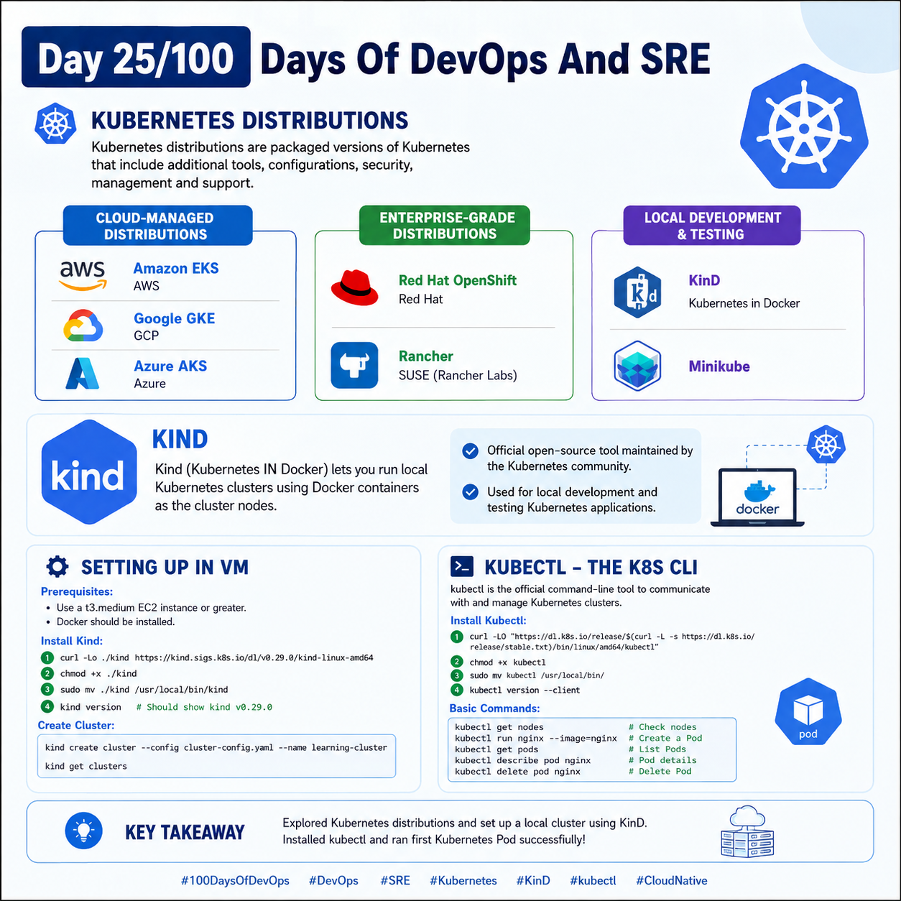
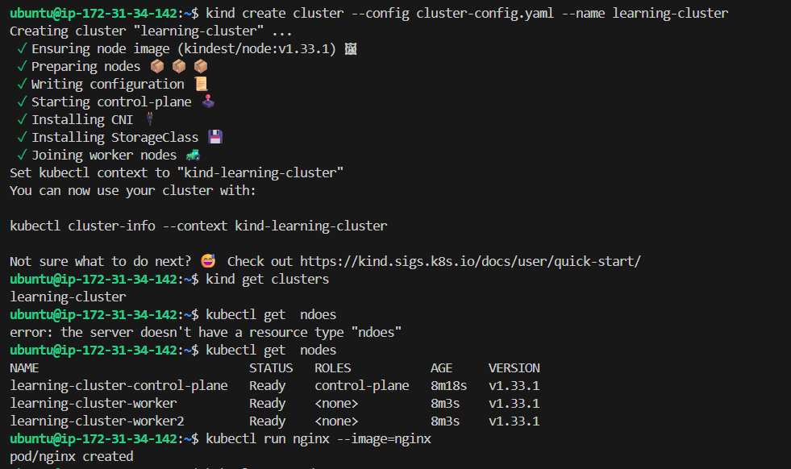

## Day 25/100 – Kubernetes Distributions & KinD

## Kubernetes Distributions:

Kubernetes distributions are the packaged versions of Kubernetes that include additions tools, configuratios, security, management and support.

**Popular Distibutions:**

Cloud-Managed Distributions :

- Amazon Elastic Kubernetes Service (EKS) - AWS

- Google Kubernetes Engine (GKE) - GCP(Google Cloud)

- Azure Kubernetes Service (AKS) - Azure

Enterprise-Grade Distributions:

- Red Hat OpenShift - Red Hat

- Rancher - SUSE (Rancher Labs)

Local Development & Testing:

- KinD - Kubernetes in Docker

- Minikube 


## KinD

Kind stands for Kubernetes IN Docker. It is a tool that lets you run local Kubernetes clusters using Docker containers as the cluster nodes.

* KinD is an official open-source tool maintained by the Kubernetes community. 

* It used in Local development, Testing Kubernetes applications.

### Installing of Kind in VM(Virtual Machine):

Prerequisites:

* Use a **t3.medium** EC2 instance or greater.
* **Docker** should be installed. If Docker is not installed, run:

```bash
sudo apt update
sudo apt install docker.io
```
**Steps:**

* Download the Kind binary

```bash
curl -Lo ./kind https://kind.sigs.k8s.io/dl/v0.29.0/kind-linux-amd64
```

* Make it executable

```bash
chmod +x ./kind
```

* Move it to `/usr/local/bin`

```bash
sudo mv ./kind /usr/local/bin/kind
```

* Verify the installation

```bash
kind version
```

You should see something like:

```text
kind v0.29.0
```

### Creating a K8s Cluster in KinD:

Add [Cluster Config](cluster-config.yaml) to your present working directory.

Run:

```
kind create cluster --config cluster-config.yaml --name learning-cluster
```

Verify:

```
kind get clusters 
```

**To access and manage the Kubernetes cluster, we need to install the `kubectl` command-line tool.**

## Kubectl:

kubectl is a offical command-line tool used to communicate with and manage a Kubernetes cluster.

* It pronounced as “kube-control”.

### Installing of Kubectl in VM(Virtual Machine):

**Steps:**

* Download the latest stable `kubectl`:

```bash
curl -LO "https://dl.k8s.io/release/$(curl -L -s https://dl.k8s.io/release/stable.txt)/bin/linux/amd64/kubectl"
```

* Make it executable:

```bash
chmod +x kubectl
```

* Move it into your system `PATH`:

```bash
sudo mv kubectl /usr/local/bin/
```

* Verify the installation:

```bash
kubectl version --client
```


Commands:

To get nodes information of k8s cluster

```bash
kubectl get nodes
```
If all the nodes are ready,

###  Create and Manage Your First Kubernetes Pod

1. Create your first Pod

```bash
kubectl run nginx --image=nginx
```

This creates a **Pod containing an Nginx container**.

2. Get Pod details

To view detailed information about the `nginx` Pod:

`kubectl get pods` displays the current Pods.

```bash
kubectl describe pod nginx
```

### 3. Delete the Pod

```bash
kubectl delete pod nginx
```
This **deletes the `nginx` Pod** from the Kubernetes cluster.


For reference:


