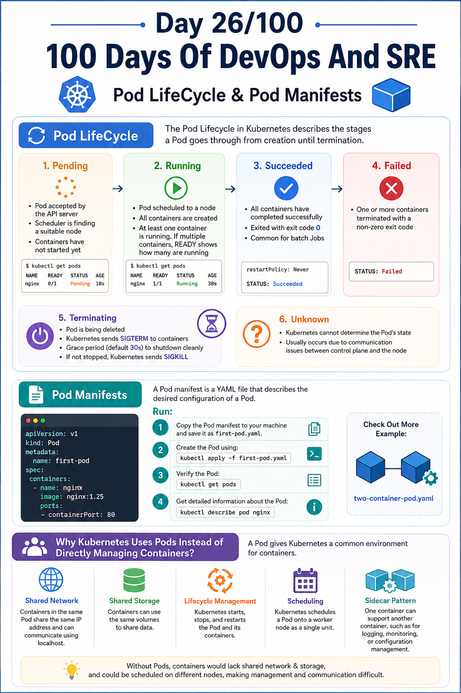
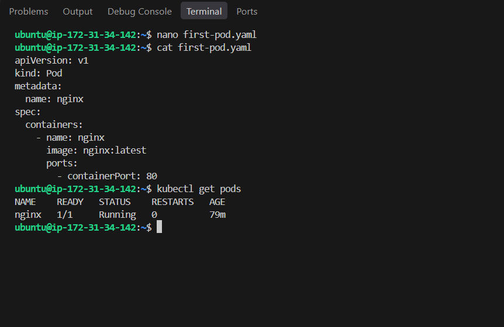

## Day 26/100 – Pod LifeCycle & Pod Manifests


## Pod LifeCycle

The Pod Lifecycle in Kubernetes describes the stages a Pod goes through from creation until termination.

Stages:

### 1. Pending

* The Pod has been accepted by the Kubernetes API server.
* The scheduler is finding a suitable node.
* Containers have not started yet.

*Example:*

```bash
kubectl get pods
```

*Output:*

```text
NAME      READY   STATUS    RESTARTS   AGE
nginx     0/1     Pending   0          10s
```

---

### 2. Running

* The Pod has been scheduled to a node.
* All containers are created.
* At least one container is running. If multiple containers are there in the Pod READY shows how many are running current.

*Output:*

```text
NAME      READY   STATUS    RESTARTS   AGE
nginx     1/1     Running   0          30s
```

---
### 3. Succeeded

* All containers have completed successfully.
* They exited with exit code **0**.
* Common for batch Jobs.

*Example:*

```yaml
restartPolicy: Never
```

*Status:*

```text
Succeeded
```

---

### 4. Failed

* One or more containers terminated with a non-zero exit code.

*Example:*

```text
STATUS: Failed
```
---

### 5. Terminating

* The Pod is being deleted.
* Kubernetes sends a **SIGTERM** signal to the containers.
* Containers have a grace period (default **30 seconds**) to shut down cleanly.
* If they don't stop within the grace period, Kubernetes sends **SIGKILL**.

---

### 6. Unknown

* Kubernetes cannot determine the Pod's state.
* Usually occurs due to communication issues between the control plane and the node.


## Pod Manifests

Pod manifest is a YAML file that describes the desired configuration of a Pod.

Check Out [First Pod Manifest](first-pod.yaml).

***Run:***

1. Copy the Pod manifest to your machine and save it as first-pod.yaml. 

2. Create the Pod using:
```
kubectl apply -f first-pod.yaml
```

3. Verify the Pod:
```
kubectl get pods
```

4. Get detailed information about the Pod:
```
kubectl describe pod nginx
```

Check Out More Example:

[two-container-manifest](two-container-pod.yaml)


## Interview Questions:

###  Why Kubernetes Uses Pods Instead of Directly Managing Containers?

A **Pod** gives Kubernetes a common environment for containers:

- **Shared Network** – Containers in the same Pod share the same IP address and can communicate using `localhost`.

- **Shared Storage** – Containers can use the same volumes to share data.

- **Lifecycle Management** – Kubernetes starts, stops, and restarts the Pod and its containers.

- **Scheduling** – Kubernetes schedules a Pod onto a worker node as a single unit.

- **Sidecar Pattern** – One container can support another container, such as for logging, monitoring, or configuration management.


> With only Container it is difficult to communication between the Container, because of no shared network and possible to scheduling to different nodes.


For reference:


