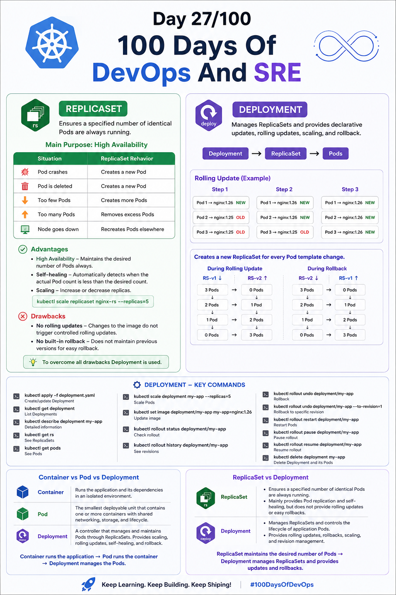
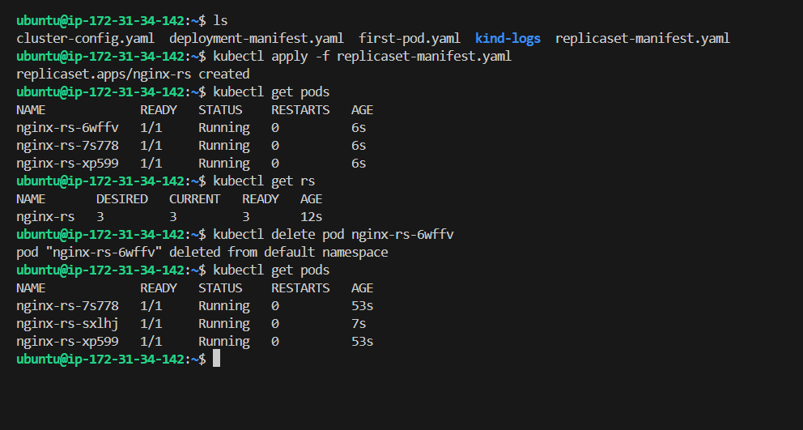
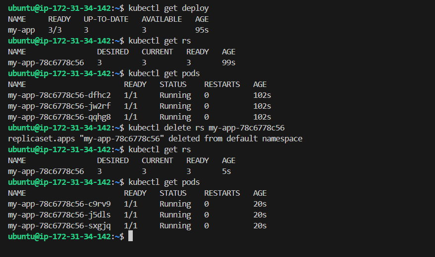
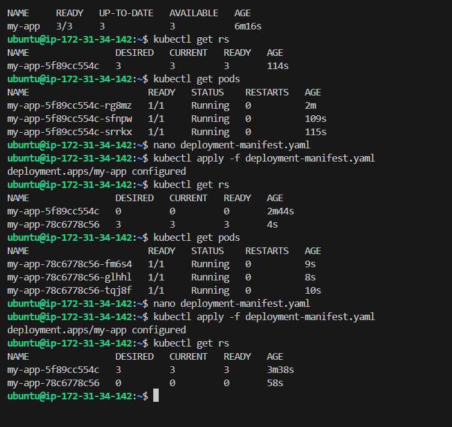

## Day 27/100 – ReplicaSet & Deployoment

## ReplicaSet

A ReplicaSet is a core Kubernetes controller designed to maintain a stable, predefined number of identical Pod replicas running in your cluster at any given time.

* ReplicaSet continuously compares the current state of Pods with the desired state and creates or removes Pods to match the desired state.

***Eg:***

If the desired Pod count = 3

The ReplicaSet continuously ensures that 3 Pods are running in the cluster.

**Main Purpose: High Availability**

| Situation | ReplicaSet Behavior |
|---|---|
| Pod crashes | Creates a new Pod |
| Pod is deleted | Creates a new Pod |
| Too few Pods | Creates more Pods |
| Too many Pods | Removes excess Pods |
| Node goes down | Helps recreate Pods elsewhere |


Check out [ReplicaSet Manifest](replicaset-manifest.yaml) to perform real example.

***Advantages:***
1. High Availability - Maintains the desired number of Pod always.
2. Self-healing - Automatically detects when the actual Pod count is less than the desired count.
3. Scaling - Increase or decrease of replicas. `kubectl scale replicaset nginx-rs --replicas=5`


***Drawbacks:***

1. No rolling updates - If you change the container image, ReplicaSet doesn't provide a controlled rolling update mechanism. Only updated Pod is created when Pod is crashed/deleted.

2. No built-in rollback - If a new application version has a problem, ReplicaSet doesn't maintain previous versions for easy rollback.

> *To overcome all drawbacks Deployment is used.*

## Deployment

Deployment is a Kubernetes object that manages ReplicaSets and provides declarative updates, rolling updates, scaling, and rollback for applications.

* Deployment → manages ReplicaSet → manages Pods

*  At Rolling update it gradually replace old Pods with new Pods. 

```
Step 1:

Pod 1 → nginx:1.26  NEW
Pod 2 → nginx:1.25  OLD
Pod 3 → nginx:1.25  OLD

Step 2:

Pod 1 → nginx:1.26  NEW
Pod 2 → nginx:1.26  NEW
Pod 3 → nginx:1.25  OLD

Step 3:

Pod 1 → nginx:1.26  NEW
Pod 2 → nginx:1.26  NEW
Pod 3 → nginx:1.26  NEW
```

* At rollback it gradually replace old Pods with new Pods. [Same as like above]

* It creates a new ReplicaSet for every Deployment's Pod template changes.
    
    * During rolling update:
    ```
    RS-v1 ↓        RS-v2 ↑

    3 Pods         0 Pods
    ↓              ↓
    2 Pods         1 Pod
    ↓              ↓
    1 Pod          2 Pods
    ↓              ↓
    0 Pods         3 Pods
    ```
    * During Rollback:
    ```
    RS-v2 ↓        RS-v1 ↑

    3 Pods         0 Pods
    ↓              ↓
    2 Pods         1 Pod
    ↓              ↓
    1 Pod          2 Pods
    ↓              ↓
    0 Pods         3 Pods
    ```


Eg:

Check out [Deployment Manifest](deployment-manifest.yaml)


**Commands:**

| Command | Purpose |
|---|---|
| `kubectl apply -f deployment.yaml` | Create/update Deployment |
| `kubectl get deployment` | List Deployments |
| `kubectl describe deployment my-app` | Detailed information |
| `kubectl get rs` | See ReplicaSets |
| `kubectl get pods` | See Pods |
| `kubectl scale deployment my-app --replicas=5` | Scale Pods |
| `kubectl set image deployment/my-app my-app=nginx:1.26` | Update image |
| `kubectl rollout status deployment/my-app` | Check rollout |
| `kubectl rollout history deployment/my-app` | See revisions |
| `kubectl rollout undo deployment/my-app` | Rollback |
| `kubectl rollout undo deployment/my-app --to-revision=1` | Rollback to specific revision |
| `kubectl rollout restart deployment/my-app` | Restart Pods |
| `kubectl rollout pause deployment/my-app` | Pause rollout |
| `kubectl rollout resume deployment/my-app` | Resume rollout |
| `kubectl delete deployment my-app` | Delete Deployment and its Pods |


## Interview Questions:

###  What is the difference between the Container, Pod and Deployment?

**Container:**

- Runs the **application and its dependencies** in an isolated environment.
- It is the **actual runtime unit** where the application executes.

**Pod:**

- The **smallest deployable unit in Kubernetes** that contains one or more containers.
- Provides containers with **shared networking, storage, and lifecycle**.

**Deployment:**

- A Kubernetes controller that **manages and maintains Pods** through ReplicaSets.
- Provides **scaling, rolling updates, self-healing, and rollback**.

> **Container runs the application → Pod runs the container → Deployment manages the Pods.**


### What is difference between the ReplicaSet and Deployment?

**ReplicaSet:**

- Ensures a **specified number of identical Pods are always running**.
- Mainly provides **Pod replication and self-healing**, but does not provide rolling updates or easy rollbacks.

**Deployment:**

- **Manages ReplicaSets** and controls the lifecycle of application Pods.
- Provides **rolling updates, rollbacks, scaling, and revision management**.

> **ReplicaSet maintains the desired number of Pods → Deployment manages ReplicaSets and provides updates and rollbacks.**


For reference:




