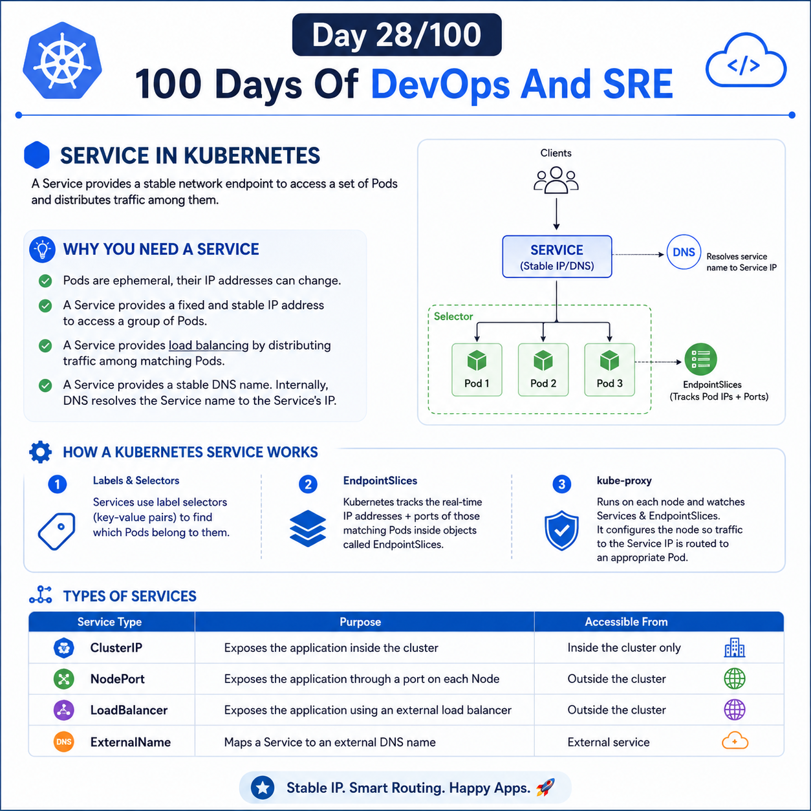

## Day 28/100 – Service in Kubernetes

## Service

A Service in Kubernetes object(same as pod,deployment) that provides a stable network endpoint to access a set of Pods and distributes traffic among them.

* A Service load-balances traffic across all Pods that match its selector.

* A Service uses label selectors to identify and route traffic to the Pods that match its selector.

* A Service gets a stable IP (virtual IP) that acts as a fixed network endpoint for accessing Pods.

### Why You Need a Service

1. **Pods are ephemeral**, so their IP addresses can change whenever Pods are deleted and recreated.

2. **A Service provides a fixed and stable IP address** to access a group of Pods.

3. **A Service provides load balancing** by distributing incoming traffic among the Pods that match its selector.

* A Service provides a stable DNS name that allows applications to access the Service without knowing its IP address. (Internally DNS resolves the Service name to the Service's IP address.)

### How a Kubernetes Service works

1. **Labels and Selectors:** Services use label selectors (key-value pairs) to find which Pods belong to them.

2. **EndpointSlices:** Kubernetes tracks the real-time IP addresses + ports of those matching Pods inside objects called EndpointSlices. 

3. `kube-proxy`: kube-proxy runs on each node and implements Kubernetes Service networking rules. It watches Services and EndpointSlices and configures(Creates/updates networking rules) the node so traffic sent to a Service's ClusterIP is routed to an appropriate backend Pod.

***Flow:***

`Service → Matching Pods → EndpointSlice → kube-proxy → Networking rules `

### Types of Services: (We will go depth in the Day-29).

| Service Type | Purpose | Accessible From |
|---|---|---|
| **ClusterIP** | Exposes the application inside the cluster | Inside the cluster only |
| **NodePort** | Exposes the application through a port on each Node | Outside the cluster |
| **LoadBalancer** | Exposes the application using an external load balancer | Outside the cluster |
| **ExternalName** | Maps a Service to an external DNS name | External service |

For reference:

