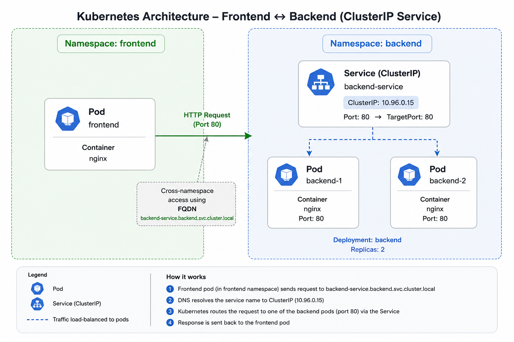
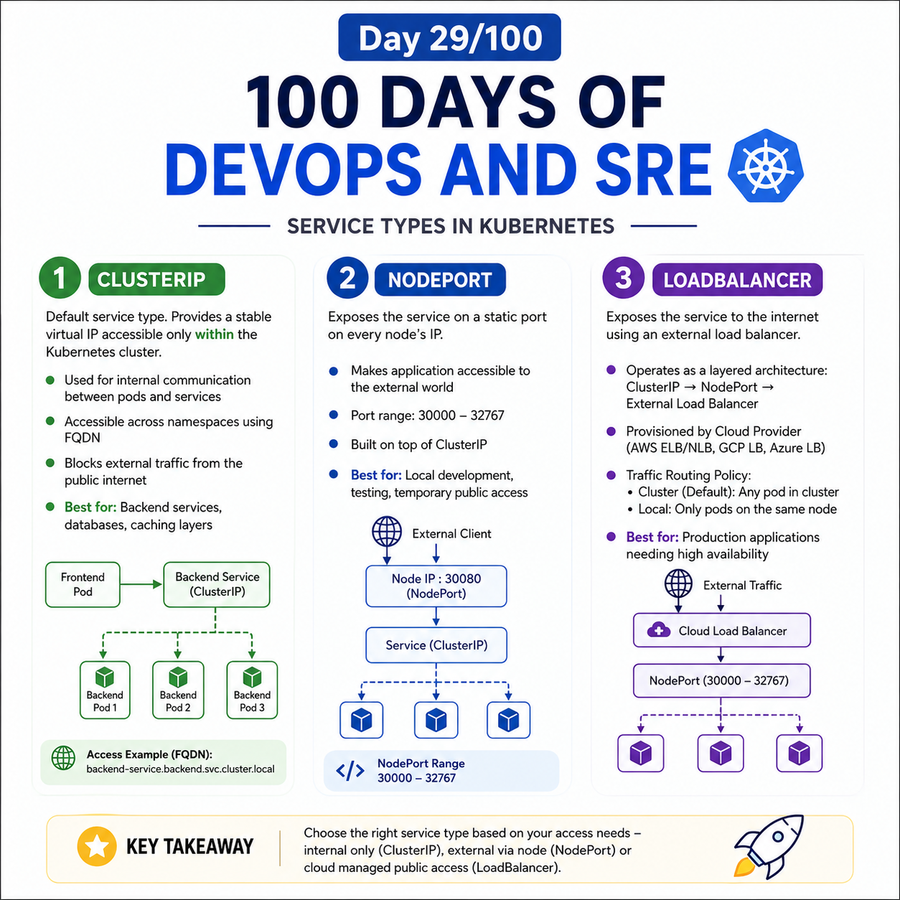
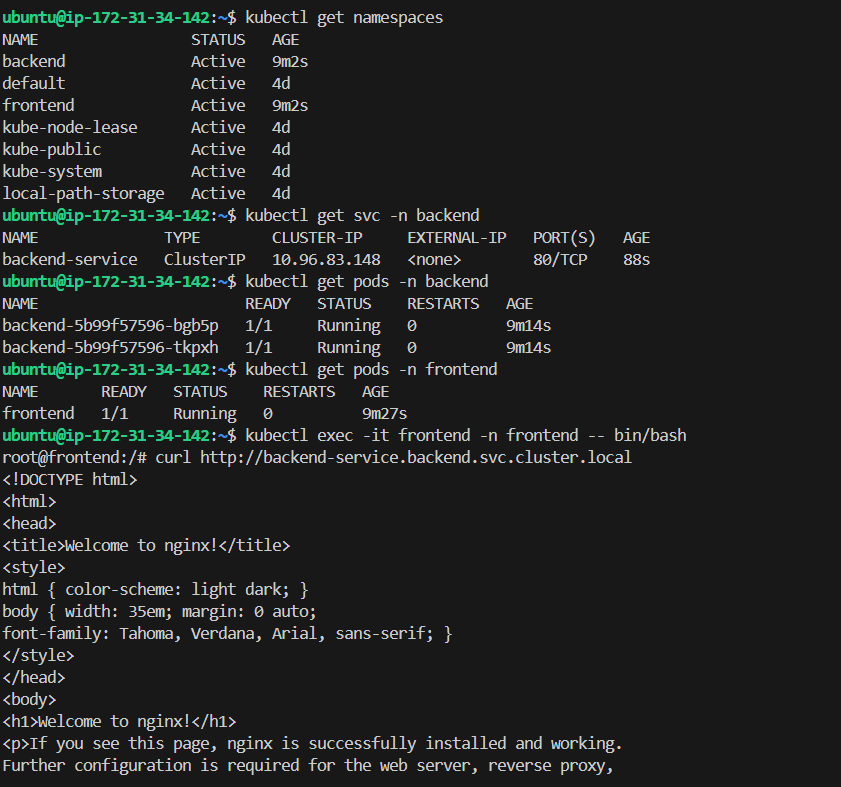
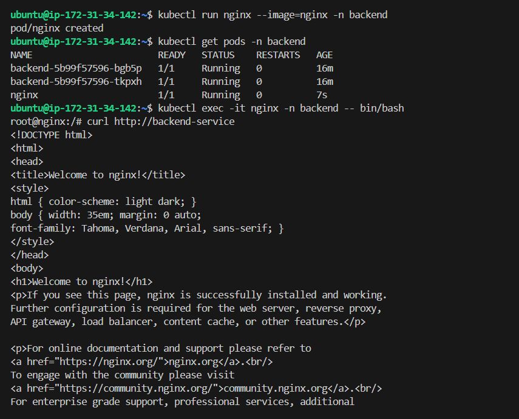

## Day 29/100 – Service types in Kubernetes

## 1. Cluster IP

ClusterIP is the default type of Kubernetes Service. It provides a stable virtual IP address that is accessible from within the Kubernetes cluster.

* We need a ClusterIP in Kubernetes to give internal microservices a stable, single virtual IP address and DNS name so they can reliably talk to each other

* ClusterIP Service can be accessed across different namespaces within the same Kubernetes cluster

    - **Within the same namespace:** You can use the short name of the Service, e.g., `my-database`.

    - **Across different namespaces:** You must use the **Fully Qualified Domain Name (FQDN)** or a **sub-domain variant**.

* It blocks outside traffic from the public internet. Especially it use for Database Pods.

* Best for: Inter-pod communication, backend microservices, internal databases, and caching layers.

* Eg:
```
    Frontend Pod
        |
        | Request
        ↓
    Backend Service
    (ClusterIP)
        |
        +--------→ Backend Pod 1
        |
        +--------→ Backend Pod 2
        |
        +--------→ Backend Pod 3
```


Real Practise Example:



Check out [ALL Manifests](frontend-to-backend.yaml) 

Steps to run:

```
```bash
kubectl apply -f app.yaml
kubectl get svc -n backend
kubectl exec -it frontend -n frontend -- /bin/bash
```
```
curl http://backend-service.backend.svc.cluster.local
```

***Flow:***
```
Frontend Pod
    |
    | curl http://backend-service.backend.svc.cluster.local
    ↓
Kubernetes DNS (CoreDNS)
    |
    | Resolves backend-service.backend.svc.cluster.local
    ↓
Backend Service (ClusterIP)
    |
    | Service networking / kube-proxy
    ↓
EndpointSlice
    |
    | Selects one healthy Backend Pod
    ↓
Backend Pod
    |
    ↓
Backend Container
```


## 2. NodePort

A NodePort in Kubernetes is a service type that opens a specific, static port on every worker node in your cluster to route external traffic directly to your application.

* NodePort makes your application accessiable to external world.

* Best for: Local development, non-cloud testing environments, or quick temporary public access.

- **Port Allocation:** Kubernetes assigns a port from a predefined range (default is `30000` to `32767`) on every node. You can let Kubernetes pick a random port or specify one manually.

- **Traffic Routing:** When a request hits any node's IP address at that specific port (`<NodeIP>:<NodePort>`), the internal `kube-proxy` forwards the packet to a healthy backend Pod.

- **Under the Hood:** A NodePort Service automatically builds on top of an internal `ClusterIP` Service, which handles load balancing across individual Pods.


Example:

```
apiVersion: v1
kind: Service
metadata:
  name: frontend-service
spec:
  type: NodePort
  selector:
    app: frontend
  ports:
    - port: 80          # Service port inside the cluster
      targetPort: 8080  # Port where the container listens
      nodePort: 30080   # Static port opened on every node
```


* `nodePort` range is  30000 to 32767.

    * **Static Band (30000–30085):** Reserved for when you manually hardcode a `nodePort` in your YAML file.

    * **Dynamic Band (30086–32767):** Used by the cluster when you do not specify a port, allowing Kubernetes to automatically assign a random, free port.


***Flow:***
```
External Client
      │
      │ 192.168.1.10:30080
      ↓
Kubernetes Node
      │
      ↓
NodePort : 30080
      │
      ↓
kube-proxy / service networking rules
      │
      ↓
Service
      │
      ↓
EndpointSlice
      │
      ↓
Selected Pod
      │
      │ :8080
      ↓
Application
```

## 3. LoadBalancer

A LoadBalancer is a Kubernetes Service type used to expose an application to clients outside the Kubernetes cluster through an external load balancer.

* The `LoadBalancer` type operates as a layered architecture:

  1. **ClusterIP:** Kubernetes automatically assigns an internal virtual IP for in-cluster communication.

  2. **NodePort:** Kubernetes opens a port (default range: `30000–32767`) across the cluster nodes.

  3. **External Load Balancer:** The Cloud Controller Manager provisions an external load balancer, such as AWS ELB/NLB, Google Cloud Load Balancing, or Azure Load Balancer. The external load balancer routes incoming public traffic to the assigned `NodePort` on healthy cluster nodes.

* Traffic Routing Policy:

    Traffic Routing Policy determines which Pods are eligible to receive external traffic when traffic reaches a node.

    * `externalTrafficPolicy: Cluster(Default)` - Traffic can be forwarded to any matching Pod in the cluster, even if the Pod is on another node.
    * `externalTrafficPolicy: Local` - Traffic arriving at a node is sent only to Pods running on that same node.

Eg:

  ```
  apiVersion: v1
kind: Service
metadata:
  name: web-loadbalancer
spec:
  type: LoadBalancer
  ports:
    - port: 80         # The port the external load balancer listens on
      targetPort: 8080 # The port the container application listens on
      protocol: TCP
  selector:
    app: web-app       # Matches the labels defined on your target Pods

  ```
* Even we didn't specify nodeport in the manifest it creates automatically.


***Flow:***

```
Client
  │
  │ 203.0.113.10:80
  ▼
External Load Balancer
  │
  │ selects healthy node (target node)
  ▼
Node 2:31245
  │
  ▼
Kubernetes Service
  │
  │ service routing
  ▼
EndpointSlice
  │
  ├── Pod A
  ├── Pod B
  └── Pod C
```


## 4. ExternalName

An ExternalName service in Kubernetes is a special type of Service that maps an internal Kubernetes DNS name directly to an external DNS name.

* Unlike ClusterIP, NodePort, or LoadBalancer, it does not create a virtual IP or route traffic through Kubernetes.

* Best for: Hybrid-Cloud Communication, External databases,


Suppose you have an external database:

```
database.example.com
```

You can create an ExternalName Service:

```
apiVersion: v1
kind: Service
metadata:
  name: my-database
  namespace: backend
spec:
  type: ExternalName
  externalName: database.example.com
```

Now a Pod inside Kubernetes can access:

```
my-database.backend.svc.cluster.local
```

Kubernetes DNS resolves that name to:

```
database.example.com
```

***Flow:***

```
Pod
 │
 │ DNS request
 ▼
my-database.backend.svc.cluster.local
 │
 │ CNAME
 ▼
database.example.com
 │
 ▼
External Database
```


For reference:



