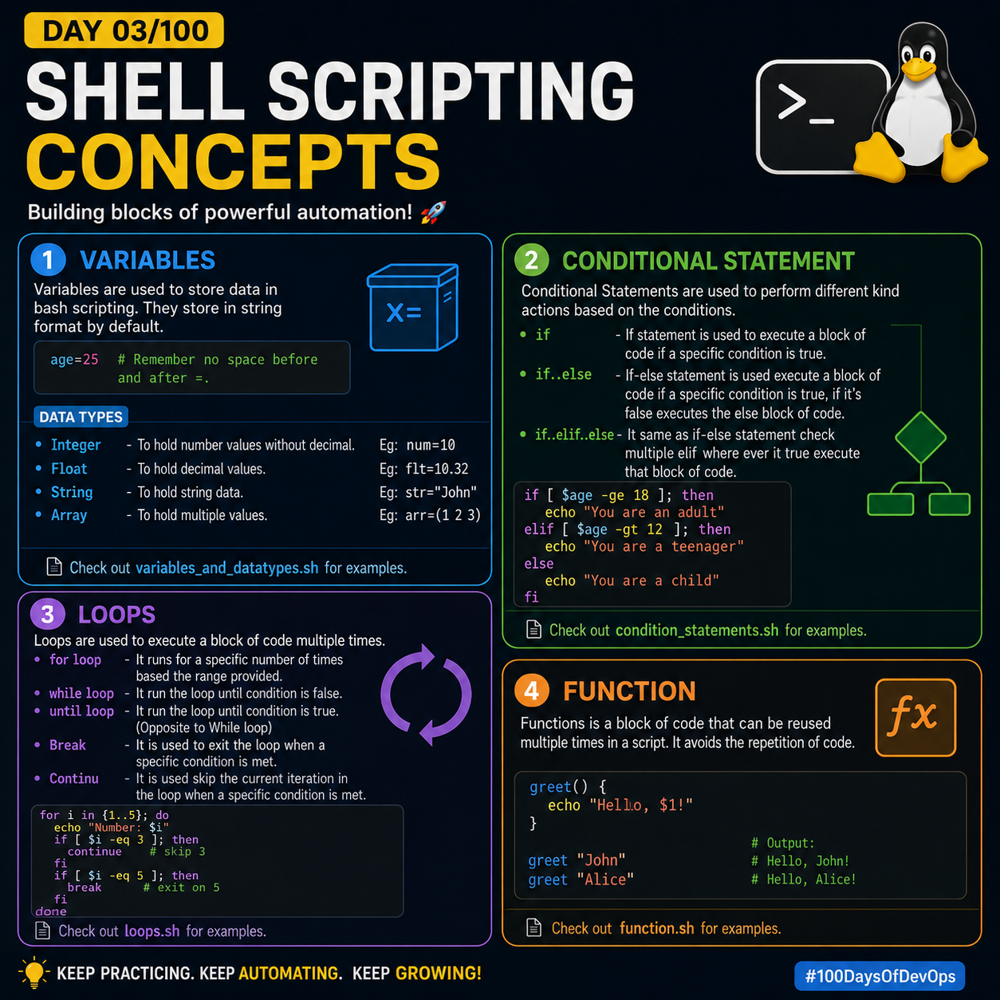
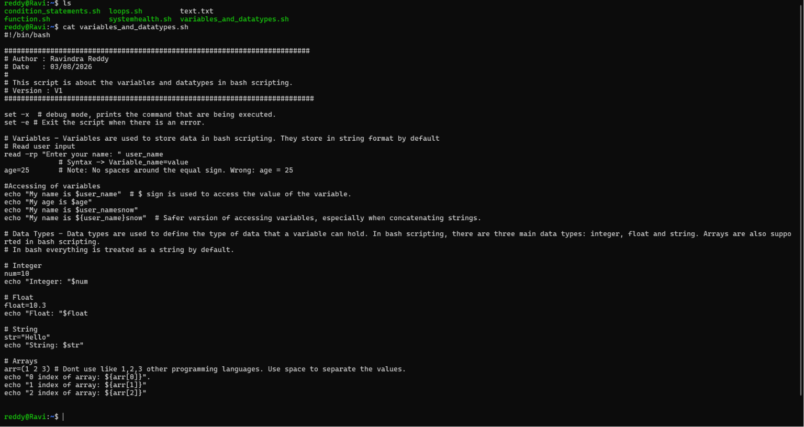
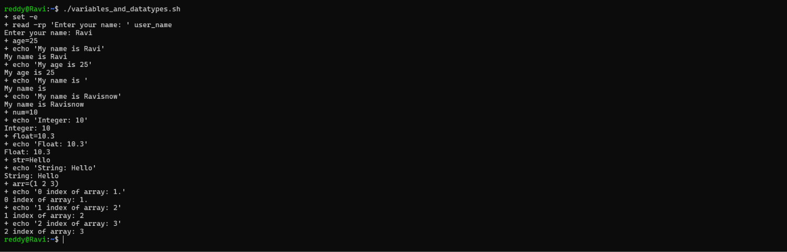

## Day 03/100 – Shell Scriping Concepts

### Variables:
Variables are used to store data in bash scripting. They store in string format by default.

Eg:

```bash
age=25 # Remember no space before and after =.
```

### Data Types:
Data types are used to define the type of data that a variable can hold.
* Interger - To hold number values without decimal. Eg: num=10
* Float    - To hold decimal values.                Eg: flt=10.32
* String   - To hold string data.                   Eg: str="John"
* Array    - To hold multiple values.               Eg: arr=(1 2 3)

Check out [variables_and_datatypes.sh](variables_and_datatypes.sh) for examples.

### Conditional Statement:
Conditional Statements are used to perform different kind actions based on the conditions.
Types:
* if             - If statement is used to execute a block of code if a specific condition is true.
* if..else       - If-else statement is used execute a block of code if a specific condition is true, if it's false executes the else block of code.
* if..elif..else - It same as if-else statement check multiple elif where ever it true execute that block of code.

Check out [condition_statements.sh](condition_statements.sh) for examples.

### Loops:
Loops are used to execute a block of code multiple times.
Types:
* for loop    - It runs for a specific number of times based the range provided.
* while loop  - It run the loop until condition is false.
* until loop  - It run the loop until condition is true. (Opposite to While loop)

- Break   - It is used to exit the loop when a specific condition is met.
- Continu - It is used skip the current iteration in the loop when a specific condition is met.

Check out [loops.sh](loops.sh) for examples.

### Function:
Functions is a block of code that can be reused multiple times in a script. It avoids the repetition of code.

Check out [function.sh](function.sh) for examples.


Check out [Day-2](../Day-2/README.md) for how to execute and definations.

Other examples: [other.sh](other.sh)    [systemhealth.sh](systemhealth.sh)


For reference:



