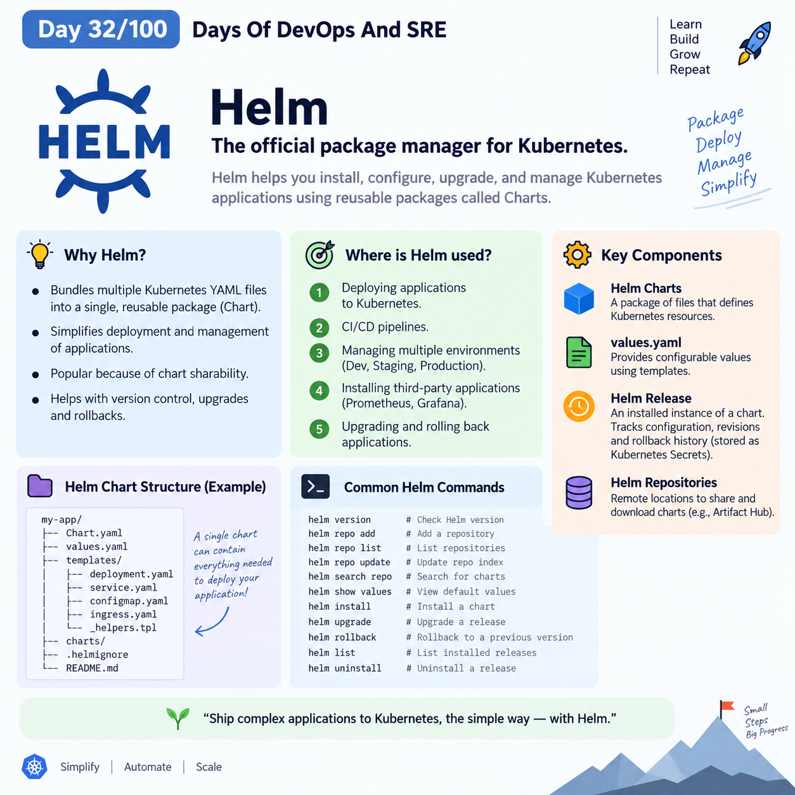

## Day 32/100 – Helm 

## Helm 

Helm is a offical Package manager for Kubernetes.

* We need Helm because manually creating and managing dozens of individual Kubernetes YAML manifest files (like Deployments, Services, ConfigMaps, and Secrets) for a single application, Helm allows you to bundle all of those resources into a single, reusable package called Charts.

* It helps you install, configure, upgrade, and manage Kubernetes applications using reusable packages called Charts.

*  Helm is popular because of Helm Charts sharability.

* Where exactly is Helm used:

  1. Deploying applications to Kubernetes.
  2. CI/CD pipelines.
  3. Managing different environments. (Development, Staging, Production).
  4. Installing third-party applications.(Prometheus, Grafana).
  5. Upgrading and rolling back applications.

* We use Helm Simplified Deployment, Version Control & Rollbacks, Reusability.


## Components of Helm

### Helm Charts

A Helm Chart is a package of files inside a specific directory structure that describes a related set of Kubernetes resources.

* It contain everything needed to deploy an application to Kubernetes.

Eg:
```
my-app/
├── Chart.yaml
├── values.yaml
└── templates/
    ├── deployment.yaml
    ├── service.yaml
    ├── configmap.yaml
    ├── secret.yaml
    └── ingress.yaml
```

### Values (values.yaml)

 Helm uses a Go-templating engine. Instead of hardcoding details (like environment names, database passwords, or CPU limits) directly into your YAML, you put placeholders in your templates. The dynamic values are injected from the values.yaml file, allowing you to use the same chart for development, staging, and production environments just by changing the values.

 Eg:

 `values.yaml`
```
replicaCount: 3
```
`deployment.yaml`
```
spec:
 replicas: {{ .Values.replicaCount }}
```

### Helm Release 

A Helm Release is an installed instance of a Helm Chart. Helm creates a release when we run helm install, and uses the release to track the application's configuration, revisions, upgrades, and rollback history

* It help for Upgrading and Rollback of applications.

* Release history is stored inside the Kubernetes cluster, by default as *`Kubernetes Secrets`*.

### Helm Repositories

These are remote locations where Helm charts are published and shared. You can use public registries like the [Artifact Hub](https://artifacthub.io/) to download pre-configured charts for popular software (like Nginx, Prometheus, or PostgreSQL), or host your own private repository


## Helm chart directory structure
```
my-app/
├── Chart.yaml
├── values.yaml
├── charts/
├── templates/
│   ├── deployment.yaml
│   ├── service.yaml
│   ├── configmap.yaml
│   ├── ingress.yaml
│   ├── _helpers.tpl
│   └── NOTES.txt
├── .helmignore
└── README.md
```

| File / Directory | Purpose |
|---|---|
| `Chart.yaml` | Contains chart metadata such as name, version, and description. |
| `values.yaml` | Contains default configuration values for the chart. |
| `templates/` | Contains Kubernetes manifest templates. |
| `templates/deployment.yaml` | Template for creating a Kubernetes Deployment. |
| `templates/service.yaml` | Template for creating a Kubernetes Service. |
| `templates/configmap.yaml` | Template for creating a ConfigMap. |
| `templates/ingress.yaml` | Template for creating an Ingress. |
| `templates/_helpers.tpl` | Contains reusable Helm template helpers. |
| `templates/NOTES.txt` | Displays helpful information after installation. |
| `charts/` | Contains dependent/sub-charts. |
| `.helmignore` | Specifies files that should not be included when packaging the chart. |
| `README.md` | Documentation for using the chart. |


## Helm Commands

| Helm Command | One-line Description |
|---|---|
| `helm version` | Displays the installed Helm version. |
| `helm repo add <name> <url>` | Adds a Helm chart repository to your local Helm configuration. |
| `helm repo list` | Lists the Helm repositories currently configured locally. |
| `helm repo update` | Downloads the latest repository index information from configured repositories. |
| `helm repo remove <name>` | Removes a Helm repository from your local configuration. |
| `helm search repo <keyword>` | Searches for charts available in your locally configured repositories. |
| `helm search hub <keyword>` | Searches Helm Hub/Artifact Hub for available charts. |
| `helm show chart <repo/chart>` | Displays metadata about a Helm chart. |
| `helm show values <repo/chart>` | Displays the default `values.yaml` configuration of a chart. |
| `helm show all <repo/chart>` | Displays all information available for a chart, including metadata, values, and templates. |
| `helm pull <repo/chart>` | Downloads a Helm chart to your local machine without installing it. |
| `helm create <chart-name>` | Creates a new Helm chart with the standard directory structure. |
| `helm lint <chart-path>` | Checks a Helm chart for possible errors and best-practice issues. |
| `helm template <release> <chart>` | Renders Helm templates locally into Kubernetes YAML without installing them. |
| `helm install <release> <chart>` | Installs a Helm chart into a Kubernetes cluster as a new release. |
| `helm upgrade <release> <chart>` | Updates an existing Helm release with a new chart or configuration. |
| `helm upgrade --install <release> <chart>` | Installs the release if it doesn't exist; otherwise, upgrades it. |
| `helm list` | Lists Helm releases installed in the current namespace. |
| `helm list -A` | Lists Helm releases across all namespaces. |
| `helm status <release>` | Shows the current status and information about a Helm release. |
| `helm get values <release>` | Displays the values currently used by an installed release. |
| `helm get manifest <release>` | Displays the Kubernetes manifests generated and deployed by a release. |
| `helm get all <release>` | Displays all available information about a Helm release. |
| `helm history <release>` | Shows the revision history of a Helm release. |
| `helm rollback <release> <revision>` | Rolls an existing release back to a previous revision. |


Reference:

