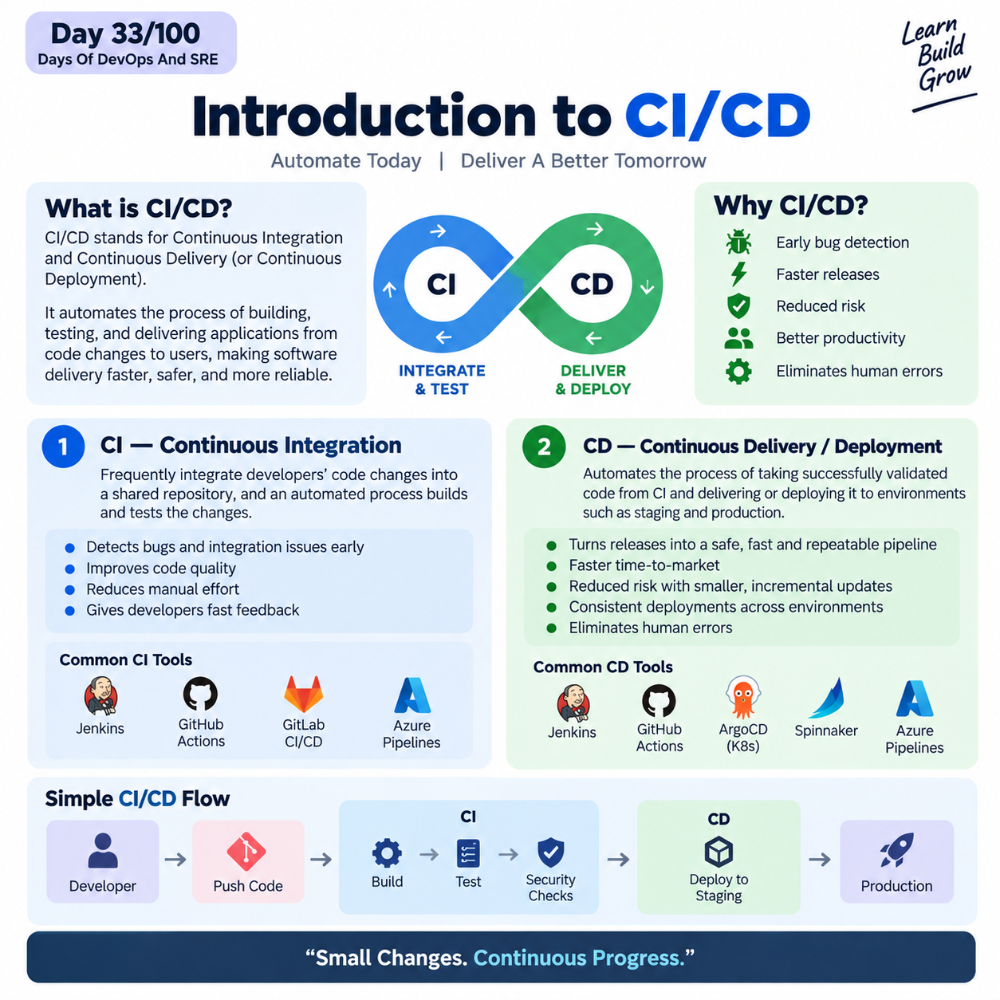

## Day 33/100 – Introduction to CI/CD

## CI/CD

CI/CD stands for Continuous Integration and Continuous Delivery (or Continuous Deployment).

* It is a software development practice that automates the process of building, testing, and delivering applications from code changes to users.

* We need CI/CD to automate and make the software delivery process faster, safer, and more reliable.

* It helps in Early Bug Detection, Faster Releases and Better Productivity.


## 1. CI — Continuous Integration

Continuous Integration means frequently integrating developers' code changes into a shared repository, and an automated process builds and tests phases.

* It helps detect bugs and integration issues early, improves code quality, reduces manual effort, and gives developers fast feedback."

* Continuous → Developers integrate changes frequently.
* Integration → Those changes are combined with the shared codebase.
* Automation → Build and tests happen automatically.

### The Standard CI Workflow :

***1. Code Commit:*** 

A developer writes code or fixes a bug on a local feature branch and pushes the changes to a shared repository like GitHub or GitLab.

***2. Automated Trigger:***  

The repository alerts the CI server (via webhooks), which automatically triggers a "pipeline" or workflow

***3. Build Execution:*** 

The CI tool compiles the code and builds the application to ensure there are no syntax or configuration errors.

***4. Automated Testing:*** 

The system automatically runs unit tests, integration tests, and quality/security checks.

***5. Feedback Loop:***
    
*If a test fails:*

The pipeline "breaks," and the developer is immediately notified to fix it.
    
*If all tests pass:* 

The code is safely merged into the main branch, and a deployment artifact (like a Docker image) is generated. 

**Common CI tools**

    Jenkins
    GitHub Actions
    GitLab CI/CD
    Azure Pipelines

### 2. Continuous Delivery or Continuous Deployment

It automates the process of taking successfully validated code from CI and delivering or deploying it to environments such as staging and production."

* It automates the release process, turning software delivery into a safe, fast, and repeatable pipeline instead of a slow, risky manual chore

* It Eliminates Human Errors.

* By establishing a CD workflow, engineering teams gain major advantages:

    1. Faster Time-to-Market - New features, bug fixes, and security patches get to users.
    2. Reduced Risk -  Shipping small, incremental updates frequently makes it much easier.
    3. Consistency - same automated scripts are used to deploy code to testing, staging, and production environments.

**Common CD tools**

    Jenkins
    GitHub Actions
    ArgoCD(K8s)
    Spinnaker
    Azure Pipelines

### Simple Flow

```
Developer
    ↓
   Push Code
    ↓
    CI
    ↓
Build → Test → Security Checks
    ↓
    CD
    ↓
Deploy to Staging
    ↓
Production
```


Reference:

