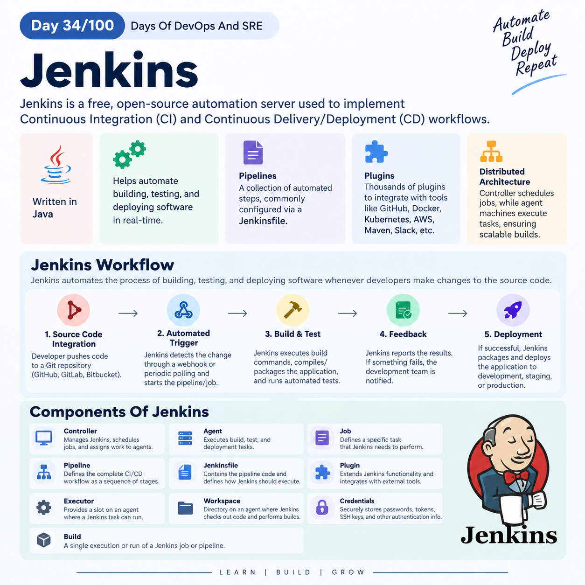

## Day 34/100 – Jenkins

## Jenkins

Jenkins is a free, open-source automation server used to implement Continuous Integration (CI) and Continuous Delivery/Deployment (CD) workflows.

* Jenkins is written entirely on Java.

* It allows DevOps teams to automate the processes of building, testing, and deploying software in real-time.

* *Pipelines:* A collection of automated steps that direct Jenkins through the lifecycle of your software. It is commonly configured via a text file called a Jenkinsfile stored alongside your project's code.
* *Plugins:* The backbone of Jenkins' flexibility. There are thousands of available plugins to integrate Jenkins with tools like GitHub, Docker, Kubernetes, AWS, Maven, and Slack. 
* *Distributed Architecture:* Jenkins uses a controller-agent (historically master-slave) setup. The central controller schedules the jobs, while separate agent machines handle the physical execution, ensuring scalable builds. 

### Jenkins Workflow

Jenkins automates the process of building, testing, and deploying software whenever developers make changes to the source code.

***1. Source Code Integration***

A developer writes code and pushes the changes to a Git repository such as GitHub, GitLab, or Bitbucket.

***2. Automated Trigger***

Jenkins detects the change through a webhook or periodic repository polling and starts the configured pipeline/job.

***3. Build & Test***

Jenkins executes the required build commands, compiles/packages the application, and runs automated tests to verify that the changes work correctly.

***4. Feedback***

Jenkins reports the build and test results. If something fails, the development team is notified so they can fix the issue.

***5. Deployment***

If the pipeline succeeds, Jenkins can package the application and deploy it to environments such as development, staging, or production.

### Components Of Jenkins

| Component | Main responsibility |
|---|---|
| **Controller** | Manages Jenkins, schedules jobs, and assigns work to agents. |
| **Agent** | Executes build, test, and deployment tasks assigned by the controller. |
| **Job** | Defines a specific task that Jenkins needs to perform. |
| **Pipeline** | Defines the complete CI/CD workflow as a sequence of automated stages. |
| **Jenkinsfile** | Contains the pipeline code and defines how Jenkins should execute the workflow. |
| **Plugin** | Extends Jenkins functionality and integrates it with external tools and services. |
| **Executor** | Provides a slot on an agent where a Jenkins task can run. |
| **Workspace** | Directory on an agent where Jenkins checks out code and performs build operations. |
| **Credentials** | Securely stores passwords, tokens, SSH keys, and other authentication information. |
| **Build** | A single execution or run of a Jenkins job or pipeline. |

For reference:

