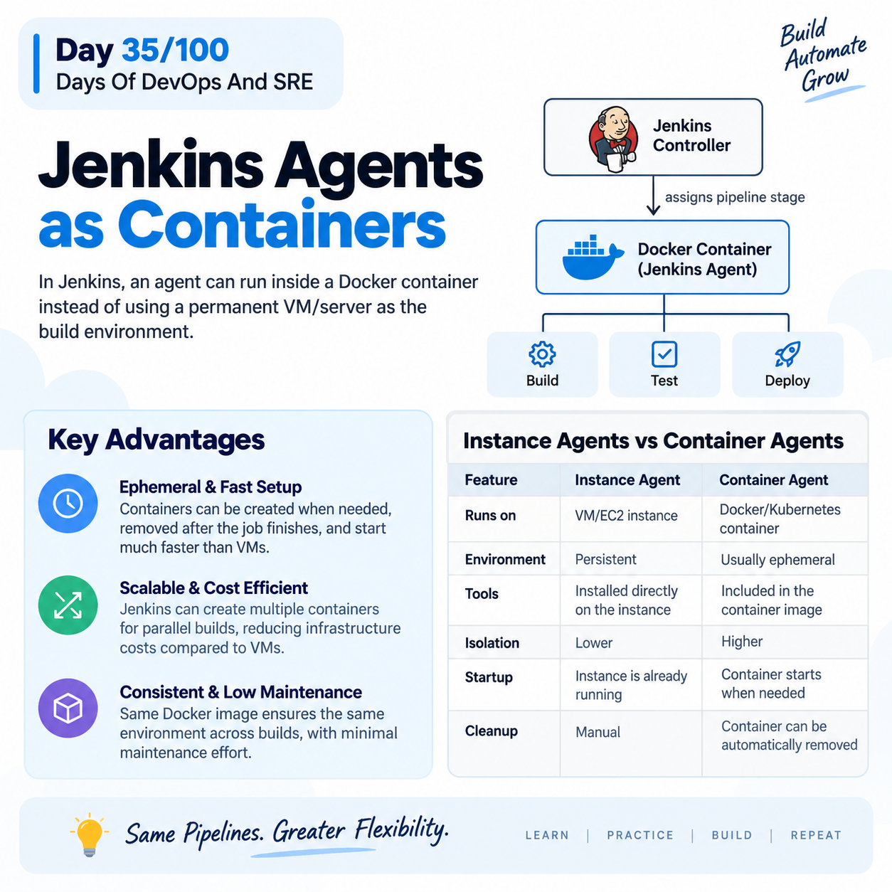
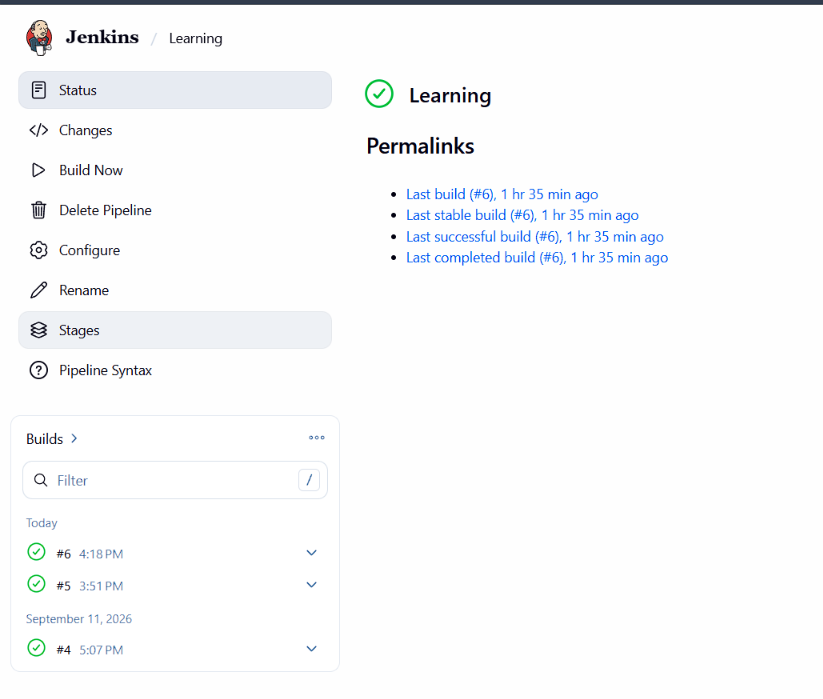

## Day 35/100 – Jenkins Practical

## Jenkins Agents as Containers

In Jenkins, an agent can run inside a Docker container instead of using a permanent VM/server as the build environment.

* Docker containers provide temporary agent execution environments.

* Jenkins Plugins needed: Docker, Docker Pipeline. 

```
Jenkins Controller
       |
       | assigns pipeline stage
       ↓
Docker Container (Jenkins Agent)
       |
       ├── Build
       ├── Test
       └── Deploy
```
### Advantages of Jenkins Agents as Containers

1. Ephemeral Agents

Containers can be created when needed and removed after the job finishes, reducing the need for permanently running agents.

2. Faster Setup

Starting a container is generally much faster than provisioning a new VM.

3. Scalability

Jenkins can create multiple containers when multiple builds need to run simultaneously.

4. Cost Efficient

Instead of creating multiple VM's, using Containers is less cost.

5. Consistency

The same Docker image provides the same environment across different builds and machines.

6. Less Maintenance

Maintaining of Containers is easy and some it is automatic process also.


## Instance Agents Vs Container Agents


| Feature | Instance Agent | Container Agent |
|---|---|---|
| **Runs on** | VM/EC2 instance | Docker/Kubernetes container |
| **Environment** | Persistent | Usually ephemeral |
| **Tools** | Installed directly on the instance | Included in the container image |
| **Isolation** | Lower | Higher |
| **Startup** | Instance is already running | Container starts when needed |
| **Cleanup** | Manual | Container can be automatically removed |


Example:

[Jenkinsfile](Jenkinsfile), It use containers as agents. Connect this Jenkinsfile to SCM, Build it.

Reference:





