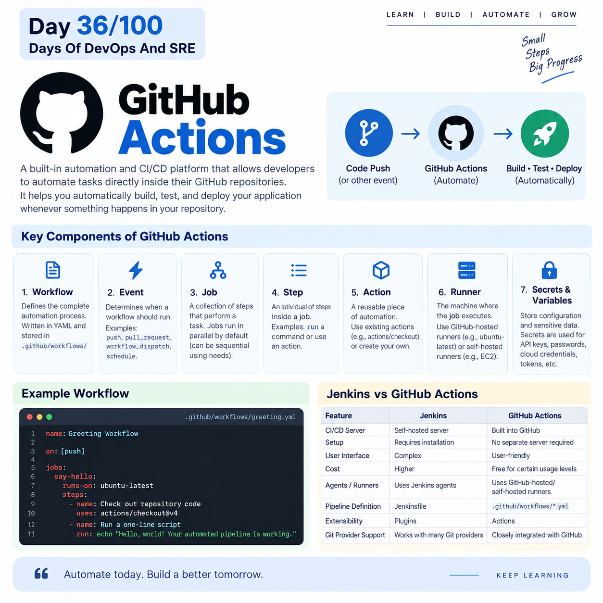

## Day 36/100 – GitHub Actions

## GitHub Actions

GitHub Actions is a built-in automation and CI/CD (Continuous Integration and Continuous Delivery) platform that allows developers to automate tasks directly inside their GitHub repositories.

* It allows you to automatically build, test, and deploy your application whenever something happens in your GitHub repository.


## Components of GitHub Actions

**1. Workflow**

* A workflow defines the complete automation process.
* Workflows are written in YAML and stored in `.github/workflows/`

**2. Event**

* An event determines when a workflow should run.
* It is like a trigger that start a workflow.

Eg:
```
Code pushed → push
Pull request created → pull_request
Manually triggered → workflow_dispatch
Scheduled execution → schedule
```
**3. Job**

* A job is a collection of steps that perform a particular task.
* By default, Jobs are run parallel in github actions. You can make run sequential using `needs`


**4. Step**
* A step is an individual task inside a job.

Eg:
```
steps:
  - name: Checkout code
    uses: actions/checkout@v4

  - name: Install dependencies
    run: npm install
```

**5. Action**
* An Action is a reusable piece of automation.

Eg:

`- uses: actions/checkout@v4`

`actions/checkout` is a pre-built GitHub Action that downloads your repository's code onto the runner.

* There are thousands of reusable actions available in the GitHub ecosystem.

* You can also create your own custom actions.

**6. Runner**

* A runner is the machine where your GitHub Actions job actually executes.

Eg:

`runs-on: ubuntu-latest`

* You can also use a self-hosted runner, such as your own EC2 instance.

**7. Secrets and Variables**

* GitHub Actions also provides Secrets and Variables for configuration and sensitive information.
* Secrets are commonly used for cloud credentials, API keys, passwords, and tokens.


## Example:

```
name: Greeting Workflow

# 1. The trigger event
on: [push]

jobs:
  say-hello:
    # 2. The operating system (runner)
    runs-on: ubuntu-latest 
    
    steps:
      # 3. Uses a community action to clone your code onto the runner
      - name: Check out repository code
        uses: actions/checkout@v4

      # 4. Runs a custom terminal command
      - name: Run a one-line script
        run: echo "Hello, world! Your automated pipeline is working."
```

## Jenkins vs GitHub Actions

| Jenkins | GitHub Actions |
|---|---|
| Self-Host CI/CD server | Built into GitHub |
| Requires Jenkins installation | No separate server required |
| User interface is Complex| User-friendly interface |
| Setup Cost is high | Setup Cost is free for certain level |
| Uses Jenkins agents | Uses GitHub-hosted/self-hosted runners |
| Pipeline commonly defined in `Jenkinsfile` | Workflow defined in `.github/workflows/*.yml` |
| Plugins are heavily used | Actions are heavily used |
| Can work with many Git providers | Closely integrated with GitHub |


Reference:




