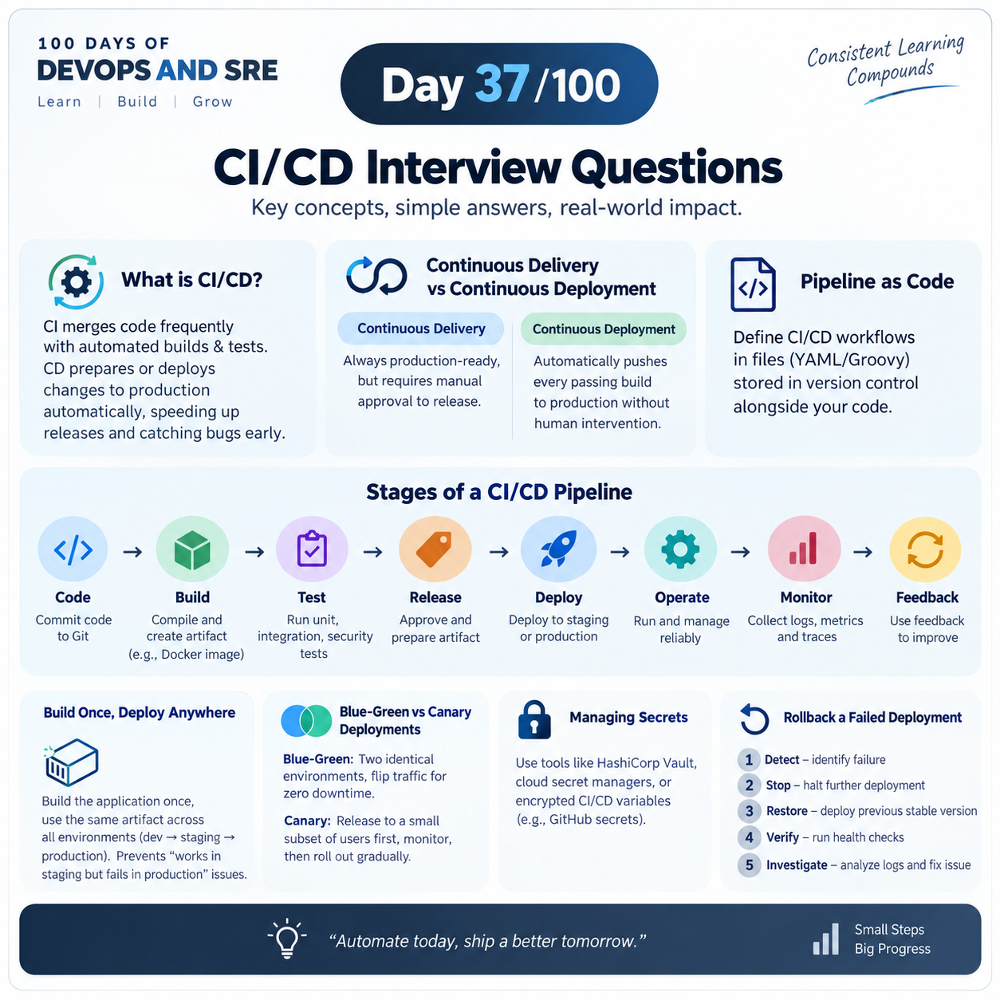

## Day 37/100 – CI/CD Interview Questions

### 1. What is CI/CD and why is it important?

Continuous Integration (CI) merges developer code changes frequently into a shared repository where automated builds and tests run. Continuous Delivery/Deployment (CD) automatically prepares or pushes those changes to production. It matters because it speeds up release cycles and catches bugs early. 

### 2. What is the difference between Continuous Delivery and Continuous Deployment?

Continuous Delivery builds and stages code so it is always production-ready, but requires manual approval to release. Continuous Deployment pushes every passing build directly to production automatically without human intervention.

### 3. What is "Pipeline as Code"?

Defining the steps of a CI/CD workflow in configuration files (like YAML or Groovy) stored inside version control systems alongside application code.

### 4. Walk me through the key stages of a standard CI/CD pipeline.

Code – Developers write and commit application code to a version-control system like Git.

Build – Compile/package the code and create a deployable artifact such as a Docker image.

Test – Automatically run unit, integration, security, and other tests to validate the code.

Release – Approve and prepare the tested artifact for deployment to an environment.

Deploy – Automatically deploy the application to staging or production infrastructure.

Operate – Run and manage the application reliably in the production environment.

Monitor – Collect logs, metrics, and traces to detect issues and measure application health.

Feedback – Use monitoring and user feedback to identify improvements and start the next development cycle.
### 5. What is the "Build Once, Deploy Anywhere" principle?

Build Once, Deploy Anywhere means build/package the application exactly once, then use that same artifact across all environments (dev, staging, production).

Build: Source code → Docker image/artifact.

Test: Test that exact artifact.

Deploy: Promote the same artifact → Dev → Staging → Production.

Benefit: Prevents “works in staging but fails in production” problems because the application binary/image is unchanged.

### 6. What are Blue-Green and Canary deployments?

Blue-Green: Maintaining two identical production environments (Blue and Green) and flipping router traffic from the old version(Blue) to the new version(Green) instantly for zero downtime.

Canary: Releasing the new version to a small subset of users first, monitoring performance metrics, and gradually rolling it out to 100% of traffic.

### 7. How do you manage secrets in CI/CD pipelines?

Use specialized secret management tools like HashiCorp Vault, cloud secret managers, or encrypted pipeline environment variables.(GitHub secrets & variables).

### 8. What is "Shift Left" security?

Integrating security checks (such as SAST, dependency scanning, and container image analysis) early in the development and CI/CD pipeline rather than testing security only at the end.

### 9. How do you rollback a failed production deployment?

Rollback means replacing the failed production version with the previous stable version.

Detect: Monitoring/tests identify that the new deployment is failing.

Stop: Stop further deployment or traffic to the faulty version.

Restore: Deploy the previous stable Docker image/application version.

Verify: Run health checks and smoke tests to confirm recovery.

Investigate: Analyze logs and fix the issue before redeploying the new version.

Reference:

