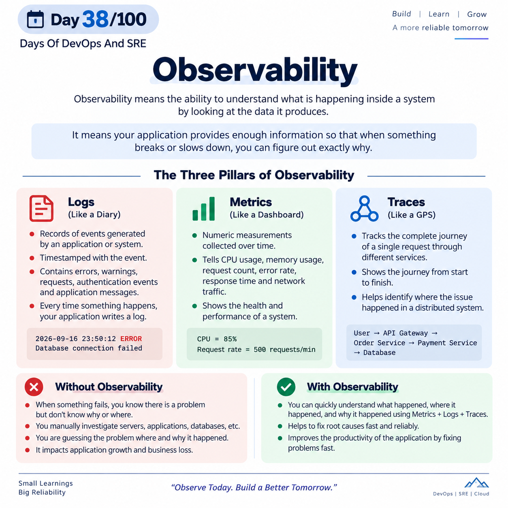

## Day 38/100 – Observability

## Observability

Observability means the ability to understand what is happening inside a system by looking at the data it produces.

* In software, it means your application provides enough information so that when some thing break or slow down, you can figure out exactly why.

* ***Observability is built on three main pillars:***

### 1. Logs (Like a Diary)

Logs in observability are records of events generated by an application or system that tell you what happened at a specific time.

* Logs are Timestamped with the event.

* Logs can contain errors, warnings, requests, authentication events, and application messages

* Every time something happens in the application, your application write a note called log.

* Eg: `2026-09-16 23:50:12 ERROR Database connection failed`

### 2. Metrics (Like a Dashboard)

Metrics in observability are numeric measurements collected over time that show the health and performance of a system.

* It tells the CPU usage, memory usage, request count, error rate, response time, and network traffic.

* Eg: `CPU = 85% & Request rate = 500 requests/min`

### 3. Traces (Like a GPS)

Traces in observability track the complete journey of a single request through different services in a distributed system.

* It shows journey from start to finish.

* Eg: `User → API Gateway → Order Service → Payment Service → Database`

## Without Observability

* When something fails, you know there is a problem but don't know why or where. You manually investigate servers, applications, databases, etc.

* Your are guessing the problem where and why it happend.

* It will impact application growth and business loss.

## With Observability

* You can quickly understand what happened, where it happened, and why it happened using Metrics + Logs + Traces.

* To fix root causes fast and reliable.

* It improve the productivity of the application by fixing problems fast.

Reference:

