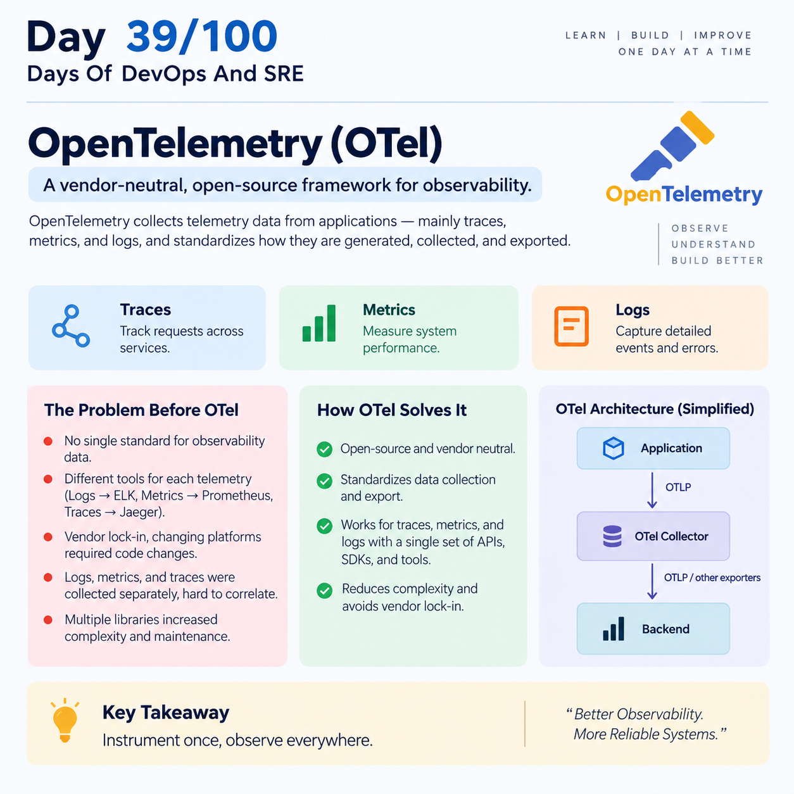

## Day 39/100 – OpenTelemetry

## OpenTelemetry(OTel)

OpenTelemetry is an open-source observability framework used to collect telemetry from applications—mainly traces, metrics, and logs.

* It is Vendor Neutrality.

* It  standardizes how applications generate, collect, and export telemetry data.

* OpenTelemetry generally collects and exports telemetry; it isn't primarily the system where you analyze and visualize it and it didn't store any data.


## Problem Before OTel Existed

There is no single, open-standard for collecting observability data. To get telemetry different tools are used for each telemetry like:
```
logs - ELK

Metrics → Prometheus

Traces  → Jaeger
```

* Developer instrumented an application specifically for one vendor, later to another platform could require changing application instrumentation.

* Logs, metrics, and traces were often collected separately, connecting them all is difficulty.

* Multiple libraries are instrumented for telemetry, it takes lot of space and increased complexity and maintenance.


## OTel Formation

OpenTelemetry was formed by merging OpenTracing and OpenCensus under the Cloud Native Computing Foundation (CNCF). It provided a single, vendor-neutral standard for APIs, SDKs, and tooling.


* OpenTracing - Focused primarily on distributed tracing.

* OpenCensus - Backed by Google and Microsoft, focused on both metrics and tracing.


## Components of OTel

### OTLP — OpenTelemetry Protocol

OTLP is the standard protocol used to send OpenTelemetry telemetry data.

```
Application
     │
     │ OTLP
     ↓
OTel Collector
     │
     │ OTLP / other exporters
     ↓
Backend
```

### OpenTelemetry Collector

The Collector is like a central telemetry processing station.

It has three major parts:

Receiver: Receives telemetry from applications.

Processor: Batches, filters, samples, or modifies telemetry.

Exporter: Sends the processed telemetry to your chosen backend.


### APIs and SDKs


| Aspect | OpenTelemetry API | OpenTelemetry SDK |
|---|---|---|
| **Purpose** | Defines interfaces for creating telemetry such as traces, metrics, and logs. | Provides the implementation that processes and exports telemetry. |
| **Audience** | Mainly application developers who instrument applications. | Developers, DevOps, and SREs configuring telemetry behavior. |
| **Implementation** | Provides interfaces; it does not itself perform telemetry processing or exporting. | Implements providers, processors, samplers, and exporters. |
| **Processing** | ❌ Does not process telemetry. | ✅ Processes telemetry using processors and samplers. |
| **Exporting** | ❌ Does not export telemetry. | ✅ Exports telemetry through configured exporters. |
| **Dependencies** | Generally lightweight. | Usually larger because it contains implementation and configuration components. |
| 


Reference:

