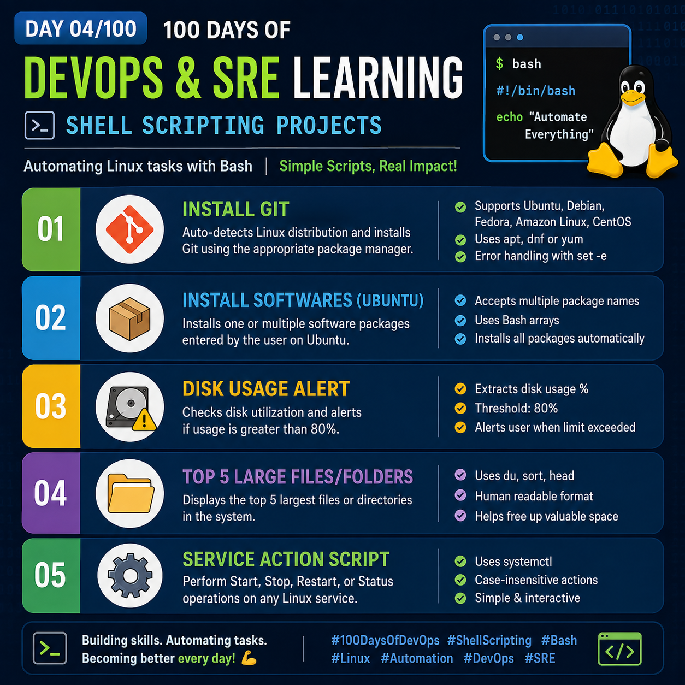
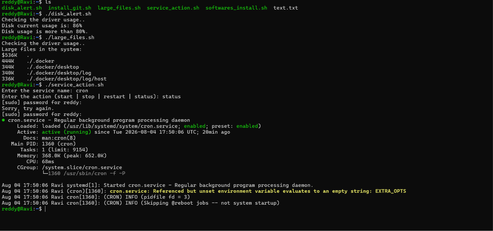

## Day 04/100 – Shell Scriping Projects

## Projects

## 1. Git Installation Script

**Description**

Automatically detects the Linux distribution and installs Git using the appropriate package manager.

**Supported Distributions**

- Ubuntu
- Debian
- Fedora
- Amazon Linux
- CentOS

Check out [install_git.sh](../Devops_Shell_Scripts/install_git.sh) for script.

## 2. Software Installation Script (Ubuntu)

**Description**

Installs one or multiple software packages entered by the user.

**Features**

- Accepts multiple package names
- Uses Bash arrays
- Installs all packages automatically

Check out [softwares_install.sh](../Devops_Shell_Scripts/software_install.sh) for script.

## 3. Disk Usage Alert Script

**Description**

Checks disk utilization and alerts the user if disk usage exceeds 80%.

Check out [disk_alert.sh](../Devops_Shell_Scripts/disk_alert.sh) for script.

## 4. Large Files/Folders Finder

**Description**

Displays the Top 5 largest directories/files in the current location.

Check out [large_file.sh](../Devops_Shell_Scripts/large_files.sh) for script.

## 5. Linux Service Manager

**Description**

Performs common service operations using systemd.

**Supported Operations**

- Start
- Stop
- Restart
- Status

check out [service_action](../Devops_Shell_Scripts/service_action.sh) for script.

In the upcoming day more projects will added in the [Devops_Shell_Scripts](../Devops_Shell_Scripts/) folder.

For reference:

