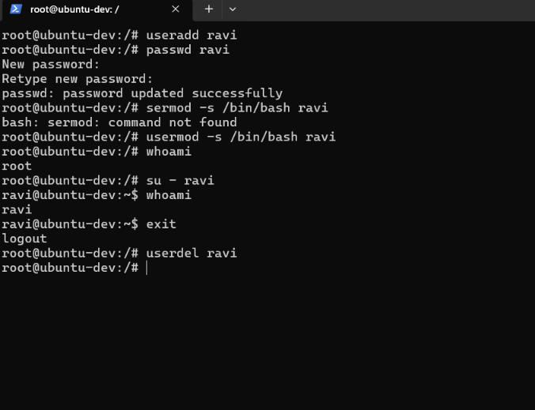
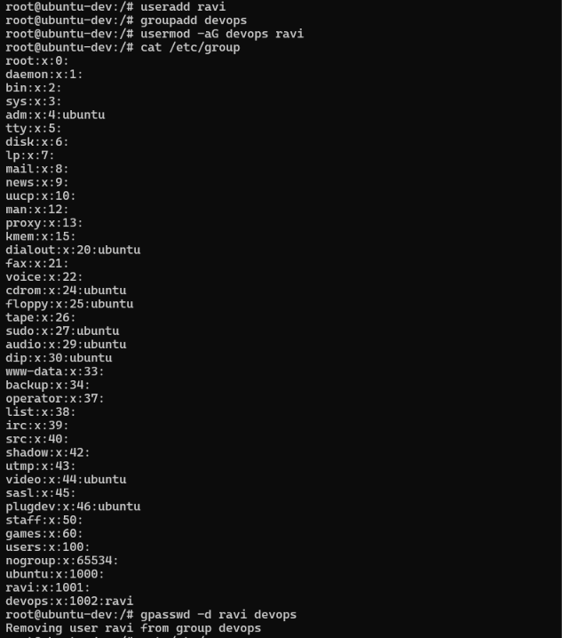

## Day 40/100 – User management in Linux

## User Management

* Linux is a multi-user operating system, meaning multiple users can operate on a system simultaneously.

* User management in Linux is the process of creating, modifying, controlling, and deleting user accounts on a Linux system.

* User management ensures security, controlled access, and system integrity.

## Types of Users

Linux categorizes accounts into three primary types based on their roles and privileges:

* **Root User:** (UID 0)This account holds complete system control, with the ability to install software, modify configuration files, and delete any data.

* **Regular/Normal users:** (UID 1000+) Created for real people to log in and work. They have full control over their own home directory but cannot alter system-wide configurations.

* **System users:** (UID Below 1000) Non-human accounts automatically created to run background services and daemons (like nginx, mysql, or ssh).

## Core Configuration Files

All user and group data in Linux is stored in simple plaintext files inside the /etc directory:

* `/etc/passwd` – Stores user account details.
* `/etc/shadow` – Stores encrypted user passwords.
* `/etc/group` – Stores group information.
* `/etc/gshadow` – Stores secure group details.

## User Management Commands

# Linux User Management Commands

| Command   | Purpose             | Example                          |
| --------- | ------------------- | -------------------------------- |
| `useradd` | Create a user       | `sudo useradd -m ravi`           |
| `passwd`  | Set/change password | `sudo passwd ravi`               |
| `usermod` | Modify user         | `sudo usermod -s /bin/bash ravi` |
| `userdel` | Delete user         | `sudo userdel ravi`              |
| `whoami`  | Show current user   | `whoami`                         |
| `su`      | Switch user         | `su - ravi`                      |
| `adduser` | Interactive User Creation | `sudo adduser ravi`

### Group Management

| Command                   | Purpose                |
| ------------------------- | ---------------------- |
| `groupadd devops`         | Create group           |
| `groupdel devops`         | Delete group           |
| `usermod -aG devops ravi` | Add user to group      |
| `groups ravi`             | Show user's groups     |
| `gpasswd -d ravi devops`  | Remove user from group |

Reference:

