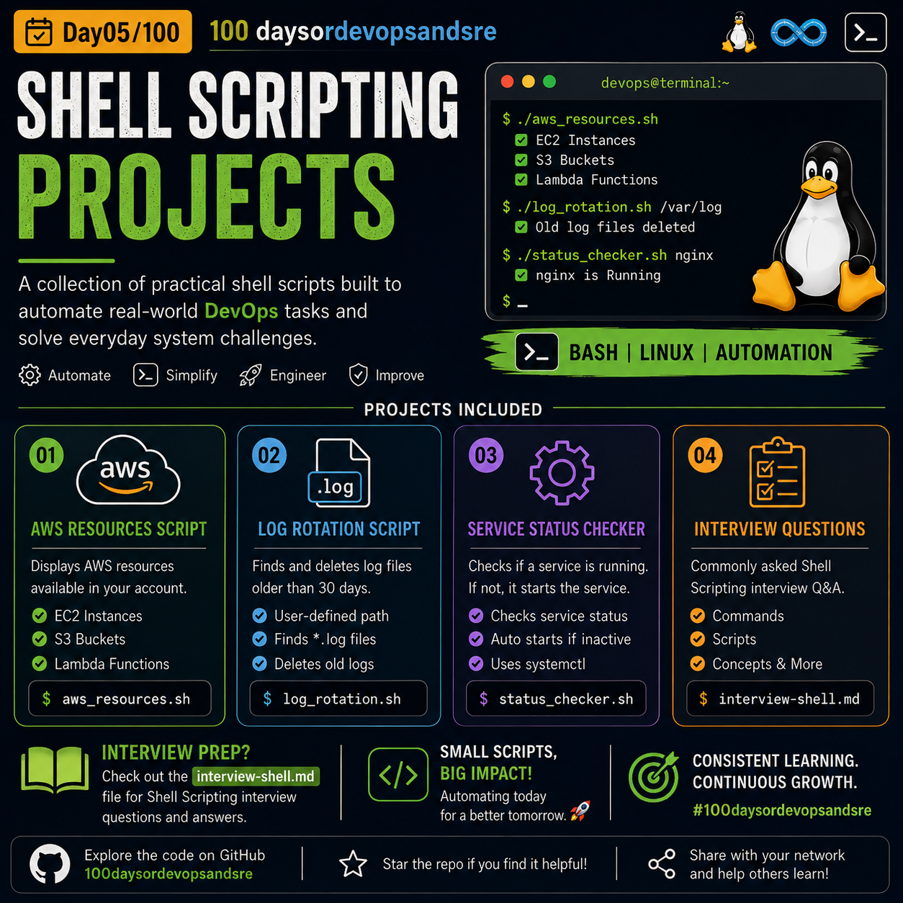
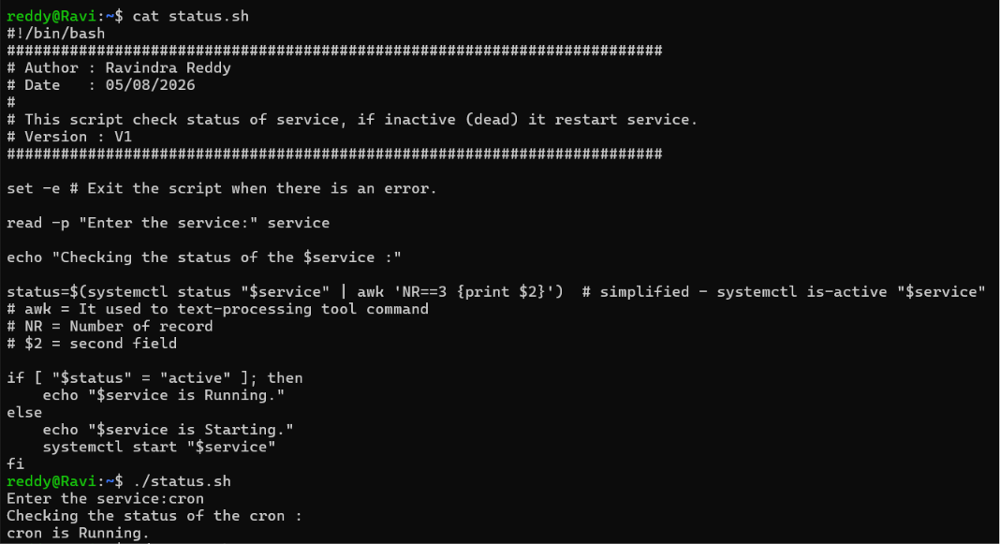

## Day 05/100 – Shell Scriping Projects & Interview Questions

## Projects

### 6. AWS Resources Script

**Description**

Displays the AWS resources available in your AWS account, including EC2 instances, S3 buckets, and Lambda functions using the AWS CLI. 

**Features**

- Lists EC2 instance names
- Lists all S3 buckets
- Lists Lambda function names

Check out [aws_resources.sh](../Devops_Shell_Scripts/aws_resources.sh) for script.

### 7. Log Rotation Script

**Description**

Searches for log files that have not been modified for more than 30 days and automatically deletes them from the specified directory. 

**Features**

- Accepts a directory path from the user
- Finds .log files older than 30 days
- Displays deleted log files
- Removes outdated log files automatically

Check out [log_rotation.sh](../Devops_Shell_Scripts/log_rotation.sh) for script.

### 8. Service Status Checker Script

**Description**

Checks whether a specified Linux service is running. If the service is inactive, the script automatically starts it.

Check out [status_checker.sh](../Devops_Shell_Scripts/status_checker.sh) for script.

In the upcoming day more projects will added in the [Devops_Shell_Scripts](../Devops_Shell_Scripts/) folder.

## Interview Questions

Check out [interview-shell.md](interview-shell.md) for commonly asked Shell Scripting interview questions along with their explanations.

In the future all shell scripting question will be added in the [interview-shell.md](interview-shell.md) file onlly.

For reference:

