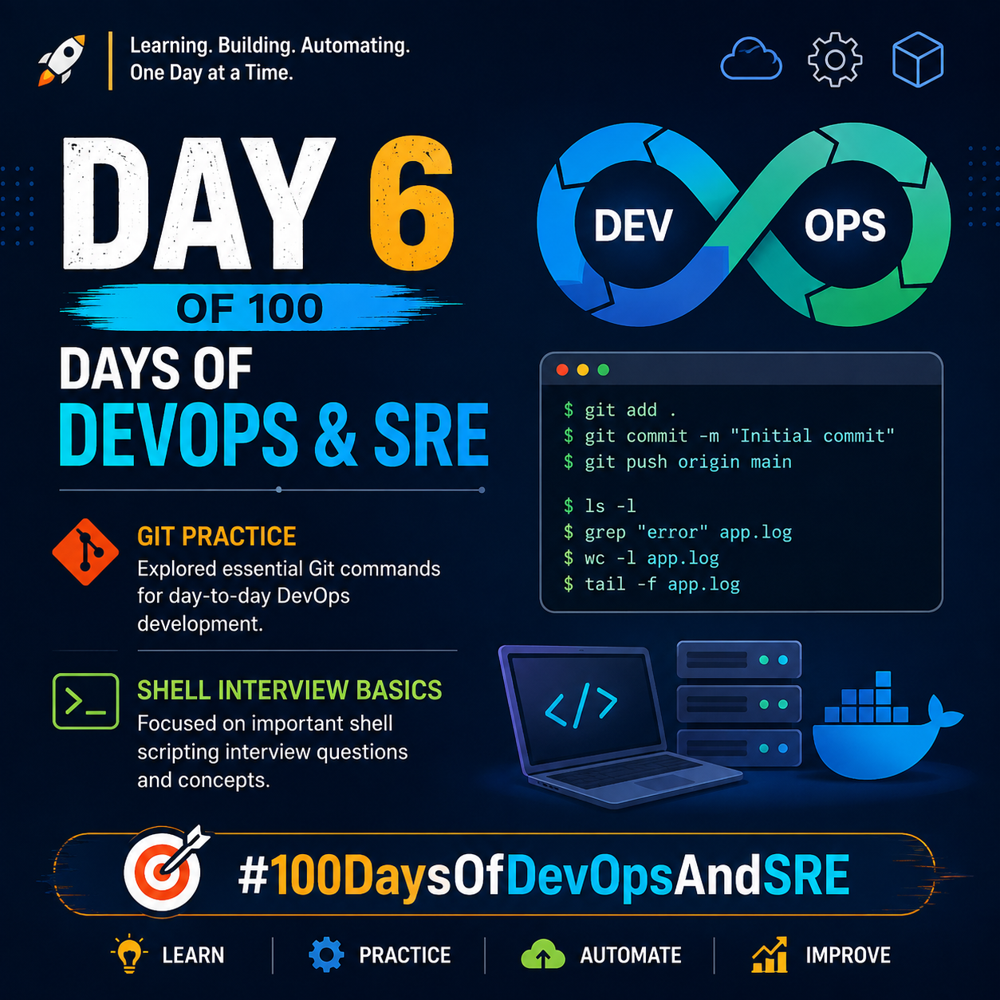
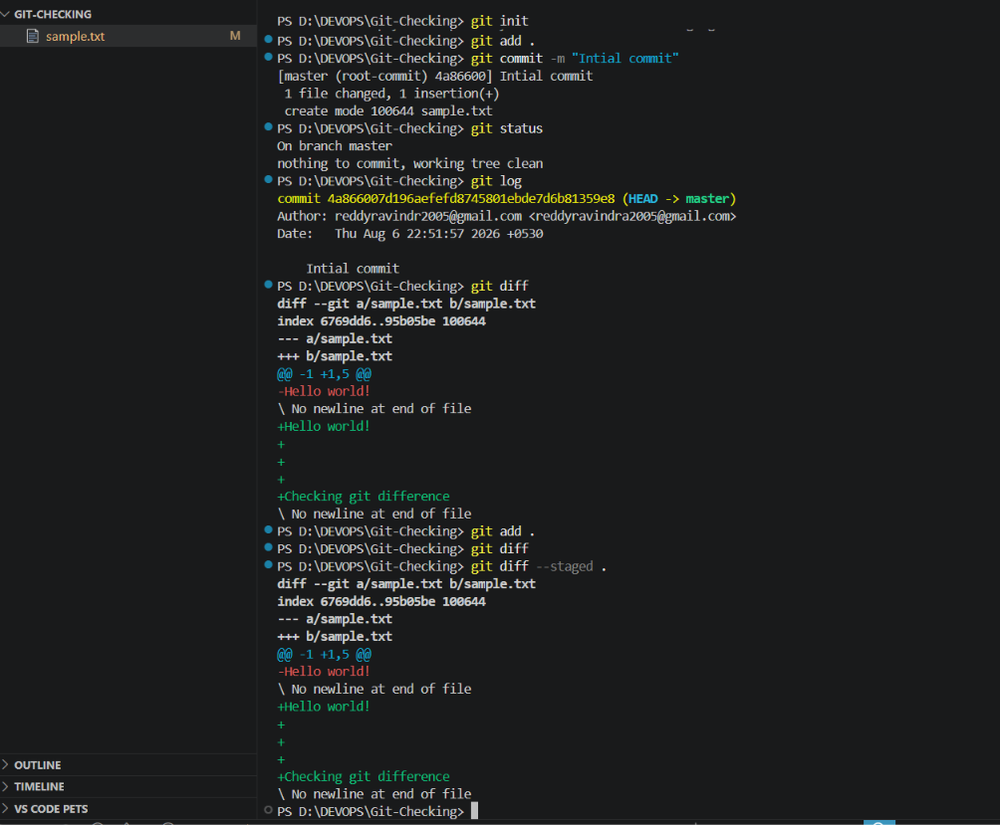
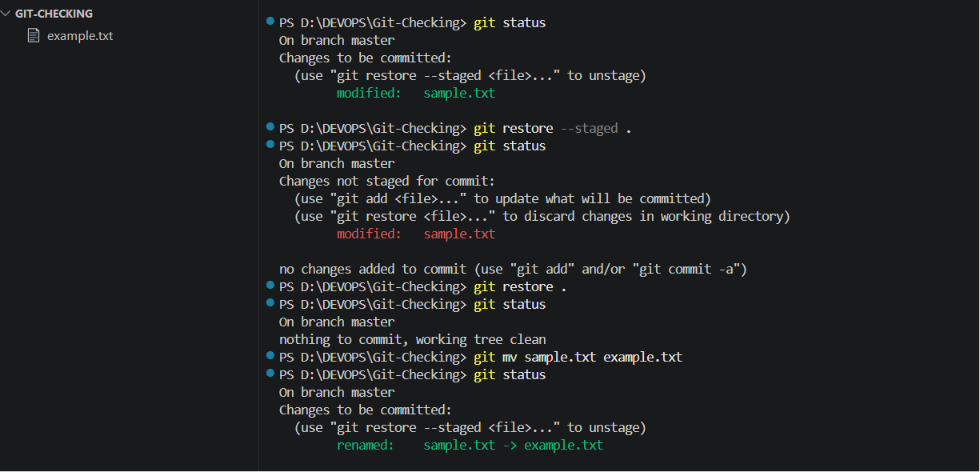
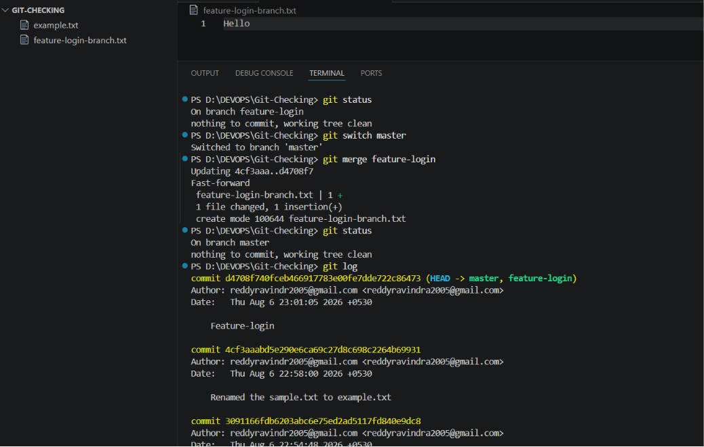

## Day 06/100 – Shell Scriping Interview Questions & Git Practise

## Interview Questions

Check out [interview-shell.md](interview-shell.md) for commonly asked Shell Scripting interview questions along with their explanations.

## Git Practise

Check out [git.md](git.md) for concise reference to essential Git commands in day-to-day devops.

Practise :

