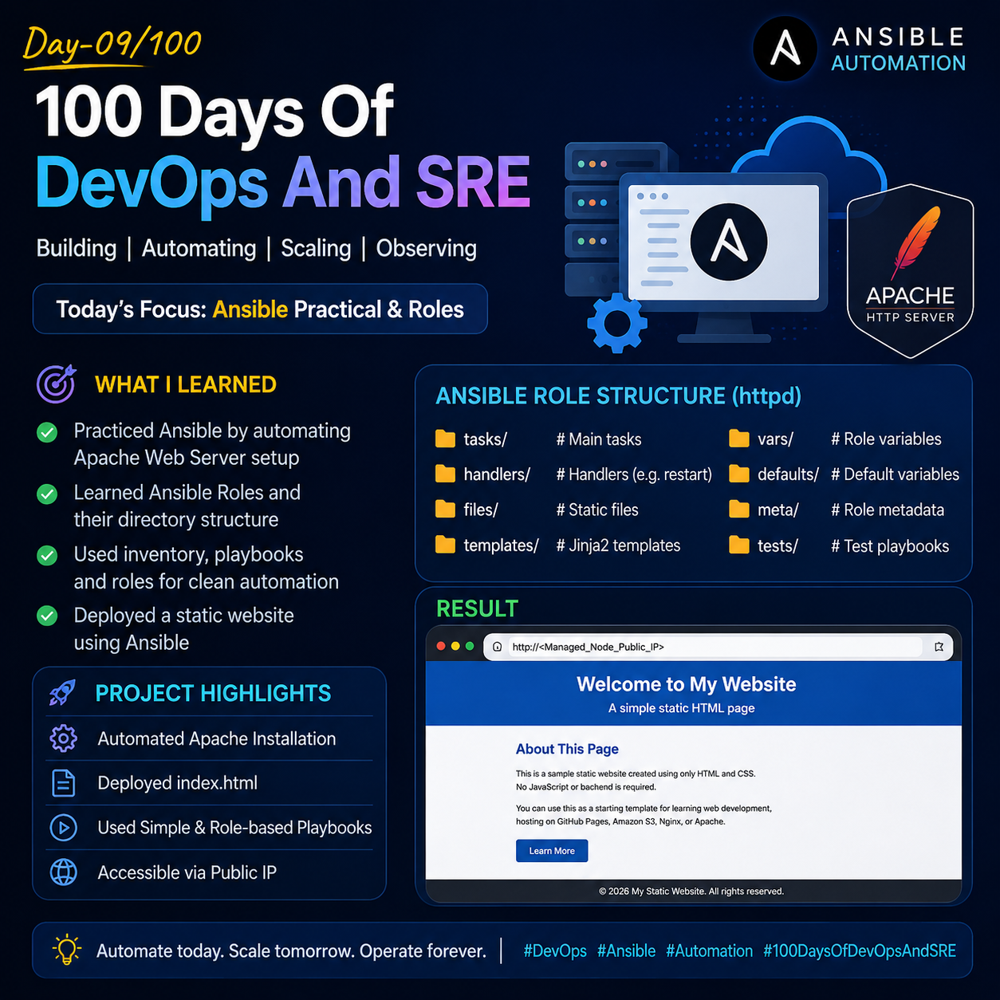
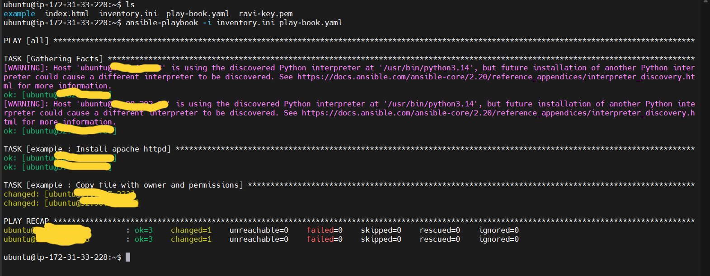
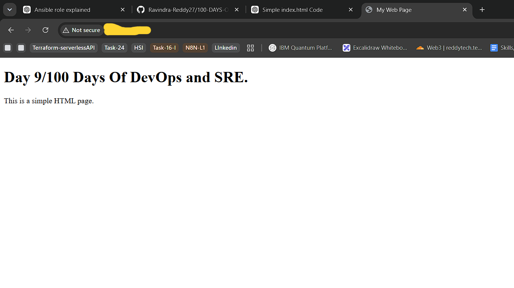
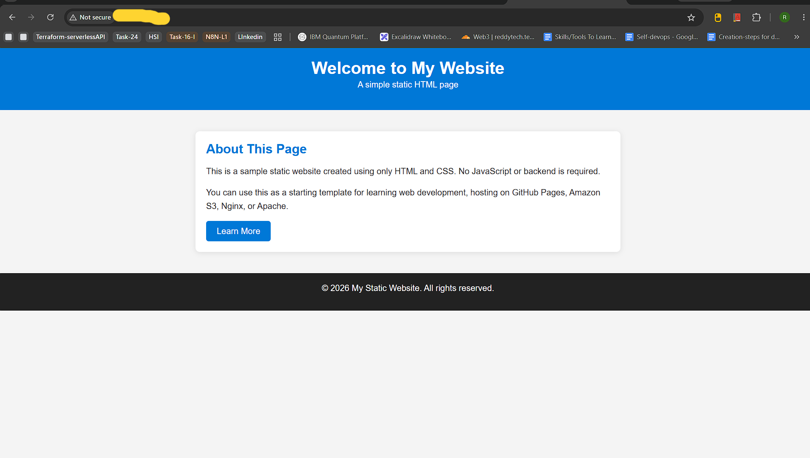
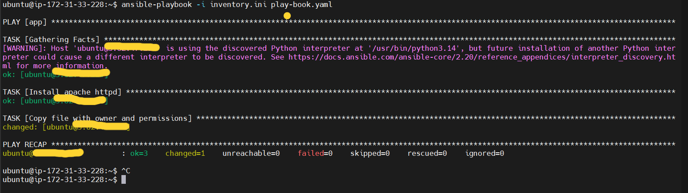

## Day 09/100 – Ansible Practical & Roles

## Ansible Roles:

- Ansible roles is a reusable and organized collection of tasks,variables,handlers,flles templates etc.
- It helps the modularization, readability, Consistency and Idempotancy.
- Role is simple words proper directory structure for a play-book.

**Structure:**
``` text
roles/
└── httpd/
    ├── tasks/         # Contains the main list of tasks that the role executes.
    │   └── main.yml
    ├── handlers/      # Stores handlers that run only when notified by a task (e.g., restart a service).
    │   └── main.yml
    ├── files/         # Holds static files that are copied directly to managed nodes. 
    ├── templates/     # Stores Jinja2 template files that can use variables before deployment.
    ├── vars/          # Contains variables with high precedence that are specific to the role.
    │   └── main.yml
    ├── defaults/      # Contains default variables with the lowest precedence, allowing users to override them.
    │   └── main.yml
    ├── meta/          # Defines role metadata such as author, dependencies, and supported platforms.
    │   └── main.yml
    ├── tests/         # Includes test playbooks and inventory files for validating the role.
    │   ├── inventory
    │   └── test.yml
    └── README.md      # Documents the role's purpose, requirements, variables, and usage instructions. 
```


## Ansible Apache Web Server Setup


This project demonstrates how to automate Apache web server installation and deployment using Ansible.

## Project Structure

```text
Day-9
├── inventory.ini
├── play-book.yaml
├── role-playbook.yml
├── index.html
└── roles/
    └── httpd/
        ├── tasks/
        ├── files/
        ├── templates/
        ├── handlers/
        ├── vars/
        ├── defaults/
        └── meta/
```

## Prerequisites

Before running this project, ensure you have:

- Ansible installed on the control node. [ Check out Day-1]
- Ubuntu managed nodes
- SSH passwordless authentication configured
- Internet connectivity on managed nodes
- Inventory file updated with your managed node IP addresses.

---

## Step 1: Configure Inventory

Edit [inventory.ini](inventory.ini) and add your managed node IP addresses.

Example:

```ini
[web]
ubuntu@YOUR_PUBLIC_IP
```

---

## Step 2: Verify Connectivity

Run the following command to verify Ansible can connect to all managed nodes.

```bash
ansible all -i inventory.ini -m ping
```

Expected Output

```
SUCCESS
```

---

## Step 3: Run the Simple Playbook

This playbook performs the following tasks:

- Installs Apache (apache2)
- Updates the package cache
- Copies `index.html` to `/var/www/html`

Run:

```bash
ansible-playbook -i inventory.ini play-book.yaml
```

---

## Step 4: Run the Role-Based Playbook

If you are using the Ansible Role (`httpd`), execute:

```bash
ansible-playbook -i inventory.ini role-playbook.yml
```

This playbook executes the `httpd` role.

---

## Step 5: Verify Deployment

Open your browser and visit:

```
http://<Managed_Node_Public_IP>
```

You should see the deployed `index.html` page.


For reference:








